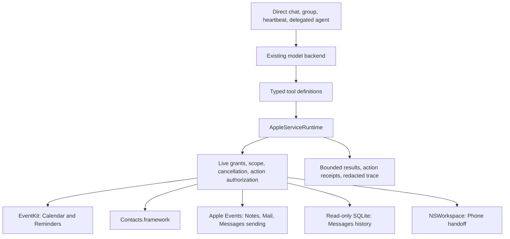

# Apple services for Chat agents

Design proposal · September 9, 2026 · No implementation changes

## Recommendation

Build a native Apple-services layer inside Chat, shared by every model backend and every agent execution mode. Use public frameworks wherever possible, typed Apple Events for scriptable applications, and a separately enabled, read-only compatibility adapter for Messages history. Keep Calendar's existing behavior while bringing it behind the same permission and execution boundary.

All integration source lives in this repository and ships in Chat.app. No installed CLIs, shell commands, `osascript`, Homebrew packages, local HTTP servers, or separately installed helpers. Apple applications may still need to launch: they own the accounts, synchronization, and Apple Events interfaces.

| Service | Integration | Initial useful scope | Main boundary |
| --- | --- | --- | --- |
| Calendar, existing | EventKit | Existing scoped event reads | Preserve current tool and grants |
| Reminders | EventKit | Lists, search, read, create, update, complete, reopen, delete | Public EventKit fields only |
| Notes | ScriptingBridge / typed Apple Events to Notes | Accounts/folders, search, read, create, append and edit simple notes | Rich and locked notes require restricted behavior |
| Contacts | Contacts.framework | Search, read, resolve recipients, create, patch | Preserve unified-contact and account semantics |
| Phone | NSWorkspace with a validated `tel:` URL | Hand a selected number to the system calling app | Handoff is not autonomous conversation or call control |
| Messages | Apple Events for sending; optional SQLite reader for history | Chats, bounded history/search, prepare/send text and supported files | History needs Full Disk Access and depends on an undocumented schema |
| Mail | ScriptingBridge / typed Apple Events to Apple Mail | Accounts/mailboxes, search/read, drafts, replies, send, flags, move | Mail owns authentication, sending, and synchronization |

The referenced screenshot was not present in the request available for this review. Repositories below are independently located references, not asserted to be the exact ones in the X post.

## Fit with the current app

`CalendarAccess.swift` already uses EventKit, limits query sizes, and filters calendars through `CalendarAccessPolicy`. `AgentStore.swift` persists per-agent tool IDs and calendar IDs; `AgentEditor.swift` exposes an All/Selected calendar picker. Those are the right starting points.

`AgentToolBox` in `SkillTools.swift` currently builds Foundation Models tools, separately describes their JSON schemas, and separately dispatches JSON calls. Calendar's policy is snapshotted into the toolbox. `AgentToolAuthorization` adds live tool and delegation checks, but does not provide a general resource-scope or mutation-authorization mechanism.

The current app target disables App Sandbox. Its entitlements do not yet include Apple Events automation, and its Info.plist has a Calendar purpose string but no Reminders, Contacts, or Automation purpose strings. The app target currently declares macOS 27.0, while project-level settings differ. Compatibility testing must use the actual target and supported shipping builds.

This design extends those structures without turning each Apple service into a skill script. The existing name `appleTools` means tools for Apple's Foundation Models backend; rename it to `foundationModelTools` when touching the registry to avoid confusing it with these service integrations.

## Execution architecture

Use concrete service protocols such as `RemindersService`, `NotesService`, and `MailService`, with typed request and response values. Share execution infrastructure, not a universal CRUD interface: completing a recurring reminder, replying to mail, and sending a text have different semantics.

Each tool definition owns its name, description, arguments, required capability, effect classification, and result projection. Foundation Models still needs concrete `Tool`/`@Generable` wrappers, but those wrappers and JSON dispatch call the same typed operation. Add parity checks for schemas and execution behavior across Foundation Models, OpenAI-compatible models, and the existing ChatGPT bridge.

An execution context carries the agent, root turn, invocation, direct/group/heartbeat/delegated origin, cancellation lease, deadline, current grant revision, output budget, and any app-recorded action authorization. Resolve live permissions before reading, immediately before committing a side effect, and before releasing results. A long-running read must not release newly forbidden content after revocation.

**Concurrency:** confine EventKit and Contacts objects to their owning service executor; transfer immutable, Sendable records. Execute synchronous ScriptingBridge work on dedicated serial queues, one per target application, with explicit Apple Event timeouts. An actor alone does not move blocking work off the main thread, especially with this project's MainActor default. Serialize dependent operations; independent reads may run concurrently. A timeout or Stop cannot retract an Apple Event already accepted by another app.

**Apple Events:** check in the small set of bindings required by the target applications' scripting dictionaries. Send values as descriptors/object properties, never interpolate model text into executable script. No agent-facing generic AppleScript or Apple Event tool. If a ScriptingBridge limitation requires lower-level events, hide that implementation behind the same typed adapter. [Apple's ScriptingBridge guide](https://developer.apple.com/library/archive/documentation/Cocoa/Conceptual/ScriptingBridgeConcepts/Introduction/Introduction.html) describes this embedded Cocoa approach.

Launch a target only when needed; avoid bringing it to the foreground for background reads. Explicit “Show in Notes/Mail/Messages” actions may activate it. If an app is hung or unavailable, return an actionable state instead of retrying indefinitely or falling back to UI clicking.

## Permissions and agent experience

Provide an **Apple Services** section in app preferences for device connections, and service cards in each agent's Tools tab for access grants.

Global cards distinguish Not connected, Ready, Permission denied, App unavailable, and Limited support. Messages has separate indicators for Sending and History. Device permission requests happen in a user-driven connection flow; heartbeats and background delegation return `needs_setup` rather than unexpectedly showing system dialogs.

Per-agent grants contain:

- Allowed operations: read, create, update, complete, delete, prepare, send, or call handoff as applicable.
- Allowed resources: reminder lists; Notes accounts/folders; Contacts containers/groups/selected contacts; Messages conversations; Mail accounts/mailboxes and sending identities.
- Communication destinations: exact permitted addresses/numbers or a selected group conversation, independent from permission to look someone up in Contacts.
- Execution context: interactive use and, separately, unattended heartbeat/dispatch use.

All new services start off. Preserve existing Calendar enablement and All/Selected choices. Explicit All includes newly added resources; Selected remains an exact selection. Folder descendants are included only when the user selects that option. A newly created object in an allowed container is usable immediately; a newly created container does not silently expand the grant. IDs are opaque locators, never authorization tokens. Every lookup, cached result, attachment, and open action rechecks resource scope.

Reminders' OS permission grants read/write together; Chat still enforces read-only agent grants. Calendar permission does not grant Reminders permission. [EventKit authorization](https://developer.apple.com/documentation/eventkit/accessing-the-event-store) and [Contacts authorization](https://developer.apple.com/documentation/contacts/cncontactstore/requestaccess(for:completionhandler:)) are separate app-level gates.

Communications use an app-owned prepared action containing the exact sender, destination, body, and attachment references. An explicit user instruction or an applicable standing grant can authorize execution without another confirmation. When those do not cover the action, present that finished action for approval. The model cannot self-authorize by setting `confirmed: true`. Record authorization from the app's user interaction or persisted grant, bound to the exact payload and agent. Changes invalidate it.

Normal granted reminder edits and draft creation execute directly. Broad or destructive changes show an affected-item preview when not already covered by an explicit authorization. The UI presents concrete content and recipients, not framework names. Phone's system call UI may still require its own user interaction.

**Delegation:** preserve the existing directed consult/dispatch model. A target uses its own service grants; delegating does not grant the caller direct access. Consultation can intentionally return information from a more privileged target, so its configured relationship is an information-sharing grant. Outbound communication grants additionally specify whether delegated or unattended requests may use them. Authorization for a particular outbound action does not transfer implicitly to another agent.

**Existing script escape hatch:** `ExecuteSkillScript` currently launches unrestricted shell scripts. A script can attempt the same APIs or data access under the process's effective OS permissions; per-agent native-service grants cannot constrain that code. The recommended managed mode excludes unrestricted skill execution for the whole invocation/delegation graph. Existing configurations using scripts must be shown as having broader access. Strong isolation while retaining scripts requires a separately designed restricted runner; source-path validation alone is insufficient. Do not present the new scopes as an OS sandbox.

## Service details

### Reminders

Use `EKEventStore` with reminder calendars and `EKReminder`. Reuse Calendar's date parsing and scope concepts, but give Reminders its own authorization and list directory. A shared EventKit owner is reasonable after parity testing; do not couple the two permission states.

Tools: `ListReminderLists`, `SearchReminders`, `ReadReminder`, `CreateReminder`, `UpdateReminder`, `SetReminderCompleted`, `DeleteReminder`. Add list management after item operations are stable.

Support title, notes, URL, priority, completion, due date, alarms, and recurrence when representable through EventKit. Treat due dates as either a calendar date or a timestamp with timezone; never silently turn “Friday” into midnight UTC. Distinguish no due date, overdue, and due today. Completion of recurring reminders follows EventKit's behavior; do not manufacture future occurrences. Preserve unknown fields during patching and reread after saving.

Subtasks, sections, smart lists, tags, rich attachments, and shared-list assignment are not initial promises. Expose per-operation capabilities instead of imitating Reminders UI features by rewriting notes or using its private database. Apple's [EventKit overview](https://developer.apple.com/documentation/EventKit) and [retrieval guide](https://developer.apple.com/documentation/eventkit/retrieving-events-and-reminders) establish the public access path.

### Notes

The installed `Notes.sdef` exposes account/folder/note IDs, HTML body, plaintext, modification date, password protection, sharing, and attachment metadata. Use that surface through Notes itself.

Tools: `ListNoteFolders`, `SearchNotes`, `ReadNote`, `CreateNote`, `AppendToNote`, `UpdateNote`, `MoveNote`, `DeleteNote`, `ShowNote`. Enable move/delete only after behavior is verified on supported builds.

Search titles first; body search is explicit and bounded to allowed folders. Return summaries and fetch the selected note's content on demand. Sanitize HTML for display and model extraction without fetching remote resources. Preserve the original representation separately from the text supplied to the model.

Create simple notes from escaped text or a supported Markdown subset. Append/edit is initially available for simple text notes whose round-trip fidelity is verified. A body setter is not proof that rich-note editing is safe: attachments, tables, checklists, drawings, and scans may not survive HTML replacement. For rich notes, return a proposed edit and offer to create a companion note or show the original. Locked-note content remains unavailable; do not unlock it or return misleading empty text. Shared folders can expose writes to collaborators and must be identified in action previews.

### Contacts

Use `CNContactStore`, selective keys, `CNMutableContact`, and `CNSaveRequest`. Contacts.app need not be running. Support `SearchContacts`, `ReadContact`, `ResolveRecipient`, `CreateContact`, and `UpdateContact`; defer merging and bulk deletion.

Resolve names into candidate endpoints with contact ID, label, exact address/number, and provenance. Use a chosen endpoint, an explicit number/address, or an established unambiguous preference; never choose the first “Alex” or silently switch between work and personal. Normalize numbers using a known region and preserve the original display value. A Contacts match does not establish iMessage availability or grant send permission.

Fetch only needed fields. Contact notes and photos are separate capabilities, absent by default. Scope filtering must not leak fields from excluded linked cards when Contacts returns a unified view; fetch permitted constituent records or reject that projection. Use field-specific patches, preserve labels and multivalued entries, verify writable destinations, and refresh after `CNContactStoreDidChange`. [Contacts documentation](https://developer.apple.com/documentation/contacts) documents fetching, saving, and change notifications.

### Phone

Support `PreparePhoneCall` and `OpenPhoneCall`. Resolve an exact phone endpoint, create the call card, then use NSWorkspace to open its validated `tel:` URL in the selected system handler. Show which application receives the handoff. Do not change the user's default handler.

The installed Phone app registers `tel:` and has bundle ID `com.apple.mobilephone`; no scripting dictionary was found in its Resources directory. Apple's [Phone Links reference](https://developer.apple.com/library/archive/featuredarticles/iPhoneURLScheme_Reference/PhoneLinks/PhoneLinks.html) documents telephone handoff, and [Phone settings](https://support.apple.com/en-gb/guide/phoneapp/phn29b80f4/mac) describe the shared Apple Account requirement.

Return `handed_off`, not “connected” or “call completed.” Availability of the app does not prove the paired iPhone or calling account is ready. No verified public interface was identified in this review for personal Phone history, voicemail, answering/hanging up cellular calls, or giving the agent call audio. Those remain unsupported pending separate research. If the intended feature is an agent that speaks on a call, that requires a distinct telephony design; `vox` uses Twilio rather than Apple's Phone service.

### Messages

Keep sending independent of history access. The installed `Messages.sdef` exposes accounts, participants, chats, and sending text/files, but not a message-history collection.

Tools: `ListMessageChats`, `SearchMessages`, `ReadMessageThread`, `PrepareMessage`, `SendPreparedMessage`, `ShowMessageChat`. Message preparation is stored in Chat because there is no assumed durable Messages draft API. Use exact chat identifiers and participant membership for group sends. Recheck membership before committing. Contact-based name enrichment requires Contacts permission and scope; otherwise show permitted raw handles.

Sending uses typed Apple Events. History uses SQLite's read-only open mode against `~/Library/Messages/chat.db`, after the user grants Chat Full Disk Access. Never write the database. Use parameterized SQL, short transactions, query budgets, and correct live WAL handling; do not open a changing database with `immutable=1` or copy just the main file and omit committed WAL content.

Probe schema features before querying; support versioned decoders for message text/attributed bodies, attachments, reactions, and edits. Decode untrusted blobs with size limits and an allowlisted parser, not arbitrary object unarchiving. Unknown formats return `unsupported_content`. Prefer message/chat GUIDs over bare row numbers; namespace locators to the local store and invalidate them after a store replacement. Results describe locally available history and do not imply complete iCloud history.

Existing chat sends and new one-to-one sends are separate capabilities to verify. Text forwarding/account setup controls SMS; do not claim a specific transport or outgoing phone number can always be forced. Sending returns `submitted` when Messages accepts the request; delivery/read status is a separate observation when available. Unsend, edits, new group management, typing indicators, and private IMCore features are outside the initial design. The [imsg documentation](https://raw.githubusercontent.com/openclaw/imsg/main/README.md) demonstrates the read-only database/automation split and identifies its private-helper features separately.

### Mail

Use Apple Mail's scripting interface for accounts, mailboxes, message metadata/content, outgoing messages, reply/forward, read/flag state, and movement. Keep credentials and transport entirely in Mail. MailKit provides extension hooks around Mail activity, rather than the general on-demand mailbox client this feature needs. [MailKit overview](https://developer.apple.com/documentation/MailKit?changes=_4).

Tools: `ListMailAccounts`, `ListMailboxes`, `SearchMail`, `ReadMail`, `CreateMailDraft`, `UpdateMailDraft`, `ReplyToMail`, `SendMailDraft`, `SetMailState`, `MoveMail`, `ShowMail`. Reply creates a draft using Mail's reply operation so addressing and threading are preserved. Sending is always a distinct action and rereads the final draft, including sender, To/Cc/Bcc, signature, and attachments.

Bound queries by mailbox, dates, fields, and scan budget. Batch metadata reads; avoid fetching every body in an inbox. Apple Events predicates and a result limit may still require expensive application-side work. Report partial coverage and timeouts honestly. Begin without a full local mail index; add an opt-in, scoped index only if measurements justify its complexity and retention cost. Do not fall back silently to Mail's private Envelope Index database, direct IMAP, or SMTP.

Mailboxes lack a simple universally durable scripting ID in the installed dictionary. Represent them with account plus validated hierarchical locator and a Chat-owned reference; refresh or require reselection after ambiguous rename/move. Bind message references to account, mailbox locator, Mail's numeric ID, and RFC Message-ID when available. The latter is a corroborating identity, not guaranteed unique across copies.

Verify saving/reopening drafts across app restarts before promising durable draft IDs. If a draft was edited in Mail, invalidate the prepared send and use the latest content. Do not automatically recreate and send a missing draft. Archive resolves the actual destination for that account; never assume an English mailbox name. Move to Trash is distinct from permanent deletion, which is deferred. Missing body/attachments while offline returns a partial result; reading must not silently mark mail as read.

## Common data and mutation contracts

Search returns compact typed records, an opaque continuation cursor, `observed_at`, coverage, truncation, and available follow-up actions. Default to 25 records, cap at 100 and a configurable output-byte budget. Bound the work as well as the output. Bind cursors to service, query, scope revision, sort order, and store identity. Reapply live grants on every page.

Return source references for grounding and app-owned “Show” actions; avoid inventing deep-link schemes. A record contains service, scoped locator, display name, container, and a revision hint where possible. `not_found_or_forbidden` avoids disclosing excluded resources. Distinguish permission denied, needs setup, app unavailable, ambiguous target, conflict, unsupported capability/schema, partial result, and uncertain action outcome.

Before update/delete, reread and compare relevant fields with the supplied revision/content digest. These interfaces do not universally provide atomic compare-and-swap; describe the remaining external-edit race rather than claiming transactional protection. Never replace an entire record for a small patch.

Persist an action ID before side effects, associated with the root turn, payload digest, destination, authorization, and state. Prepared actions transition through prepared, authorized, executing, then applied/submitted/handed_off, failed, or uncertain. These are different outcomes. A retry of the same action returns its receipt. After an ambiguous timeout or crash, reconcile when possible and never automatically repeat a send, call, or create. Most underlying APIs offer no exactly-once key.

Attachments use app-issued references, not arbitrary model-supplied filesystem paths. Recheck ownership and scope, type, size, availability, and authorization before loading or sending. Keep temporary copies in Chat-controlled storage and remove them after use. Search results expose attachment metadata first; importing content is explicit and bounded.

## Content handling and background work

Service content is untrusted input. A note, email, contact field, or message cannot change grants, authorize sending, or instruct execution of a script. Only requested excerpts enter model context. “Local integration” does not mean local model processing: show that retrieved content may go to the agent's selected remote model and may appear in saved replies or memory.

Extend recording to separate model-visible output from persisted trace output. `ToolInvocation` currently stores arguments and result text; debug payloads may also contain full prompts. Default service traces store operation, redacted target, counts, timing, and receipt state. Payload capture is separately explicit; include provider debug transcripts in the same redaction decision. Revocation clears service caches and pending unauthorized actions, but cannot retract content already sent to a provider or placed in the visible conversation.

Initially use the existing heartbeat scheduler for bounded queries while Chat runs. EventKit/Contacts notifications invalidate caches. Notes/Mail polling is scoped, incremental where supported, and backs off when apps are unavailable. Messages filesystem notifications are hints: watch database and WAL changes, with periodic reconciliation and GUID deduplication to cover missed notifications, edits, deletions, and sync backfills. Do not promise complete incoming-message delivery from filesystem events. No launch daemon or always-on external service is required.

## Source reuse and app packaging

| Reference | What to borrow | What stays out |
| --- | --- | --- |
| [openclaw/remindctl](https://github.com/openclaw/remindctl) | EventKit operation patterns, reminder edge cases, tests | CLI commands, numeric shorthand, private rich-store dependencies |
| [openclaw/imsg](https://github.com/openclaw/imsg) | Selected Swift database readers/decoders and standard sending patterns | CLI/RPC transport, injected helpers, private framework features |
| [antoniorodr/memo](https://github.com/antoniorodr/memo) | Notes workflows and scripting behavior as reference | Python/CLI runtime |
| [joshuaswanson/email-cli](https://github.com/joshuaswanson/email-cli) | Mail workflow examples and edge cases | Command execution and script-string assembly |
| [steipete/vox](https://github.com/steipete/vox) | Context only if autonomous telephony is later requested | Twilio architecture is not an Apple Phone adapter |

`imsg` already exports an `IMsgCore` Swift library separately from its executable in its [package manifest](https://raw.githubusercontent.com/openclaw/imsg/main/Package.swift). Prefer selectively vendoring audited source into Chat over depending on the whole moving package. Pin the upstream commit, inspect transitive code for subprocesses/private APIs, retain required licenses/notices, and document local modifications. The useful level of reuse is adapter code and tests; each source file still needs review before adoption.

Suggested source layout: `Chat/AppleServices/` with runtime, grants, contracts, action store, permission UI, and individual adapter directories; `Chat/AppleServices/Vendor/` for any adopted source. Keep concrete provider tool wrappers nearby. Register additive persistence models in `ChatSchema.swift`; avoid cascading relationships, consistent with the existing scalar-ID design.

Add `NSRemindersFullAccessUsageDescription`, `NSContactsUsageDescription`, and `NSAppleEventsUsageDescription`, plus the Apple Events automation entitlement for a hardened build. Full Disk Access is a user setting, not an entitlement Chat can silently grant. Use stable signing identity for permission behavior. The current non-sandboxed distribution fits this plan; an App Store/sandboxed edition requires a separate feasibility pass, especially for Messages history and target-specific Apple Events permissions. [Apple's sandboxing and automation guidance](https://developer.apple.com/library/archive/qa/qa1888/_index.html) explains those additional constraints.

## Delivery sequence and acceptance gates

1. **Shared foundation, Reminders, Contacts.** Introduce runtime/live scopes, provider wrappers, settings, action receipts, and trace projection. Preserve Calendar's tool name, grant behavior, and output contract. Add native reminder and contact reads/writes.
2. **Notes and Mail.** Prove typed Apple Events, bounded searches, rich-note restrictions, mailbox identities, saved drafts, reply semantics, and verified writes. Ship send only when action authorization and uncertain-outcome handling are ready.
3. **Messages and Phone.** Ship standard Messages sending independently of history; add the opt-in database reader after schema/decoding tests. Phone handoff is small and can ship earlier alongside recipient resolution.
4. **Background refinements.** Add scoped change tracking and optimize measured bottlenecks. Rich Notes editing, permanent deletion, advanced messaging, and autonomous calls each require an explicit later capability decision.

Validate with test-owned records/accounts and representative supported macOS builds. Required cases include revoked/changed grants during execution; direct/group/delegated/heartbeat parity; script-enabled graph restrictions; forbidden IDs/cursors/attachments; prompt injection in service content; DST/date-only reminders and recurring completion; linked contacts and ambiguous recipients; rich/locked Notes; large/offline Mail stores and draft edits; SQLite WAL/schema changes and undecodable messages; group membership changes; failed or ambiguous sends; restart/Stop during mutations; and no subprocess invocation in Apple service execution. Verify trace redaction with Debug off and exact bounded request/result capture with Debug on across all providers, plus Calendar migration without enabling any new service.

This review inspected application code, local scripting dictionaries/Phone URL registration, and the linked documentation/repositories. It did not request service permissions, read personal service data, execute integrations, or change runtime code. Documented dictionary support is a design basis; the acceptance gates above establish actual runtime reliability before shipping.
