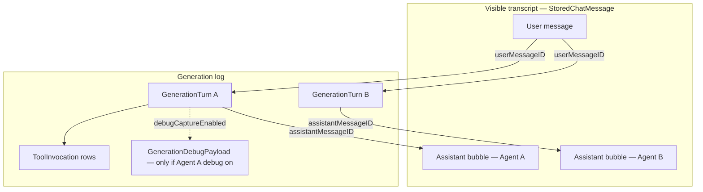
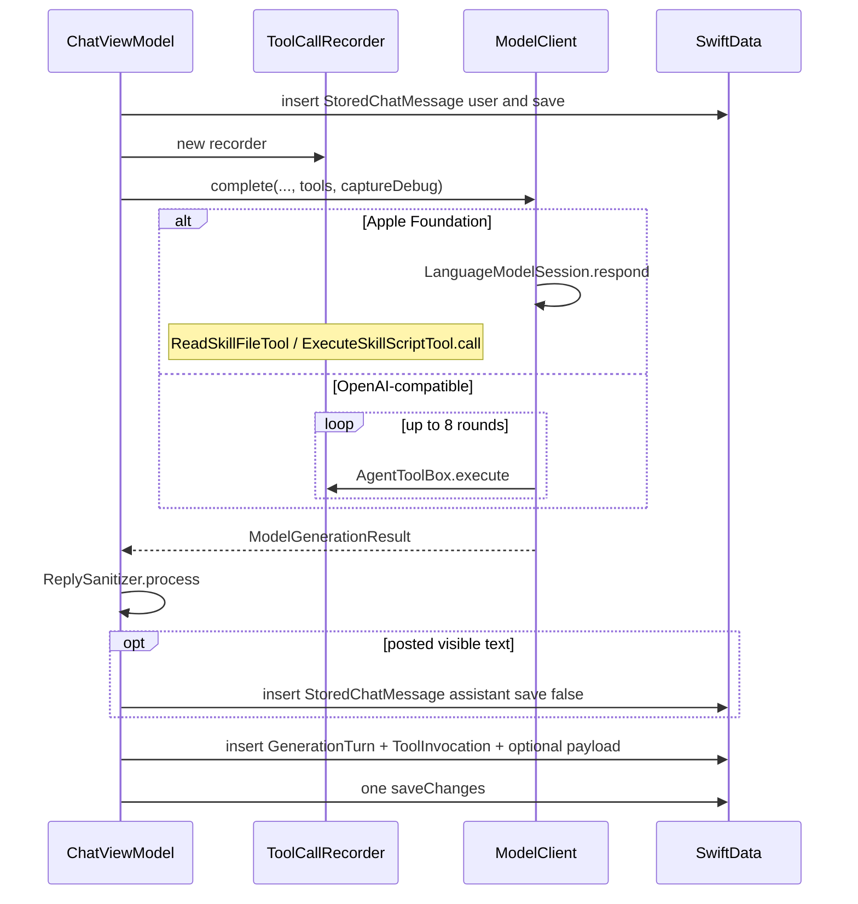
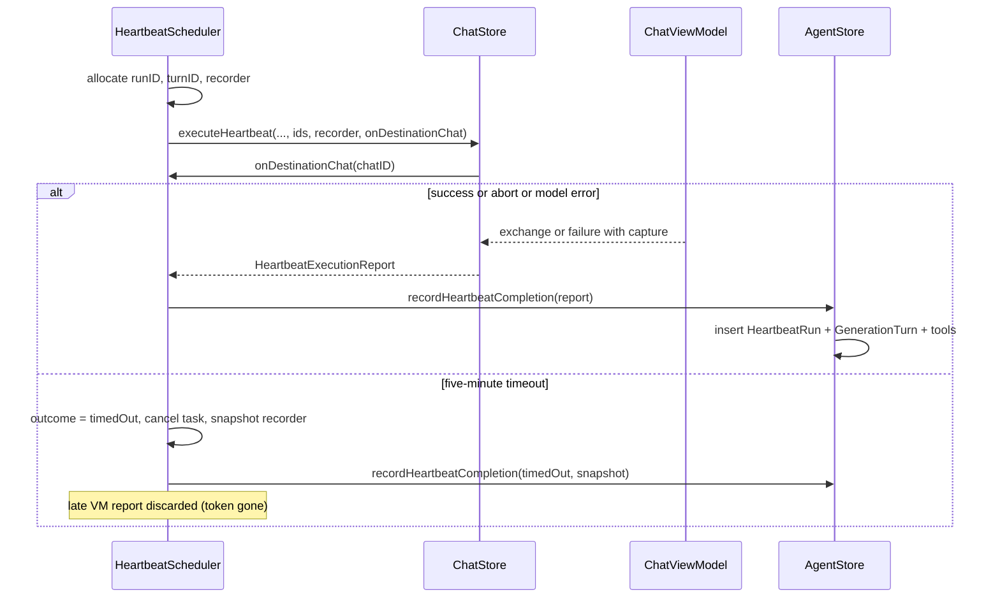
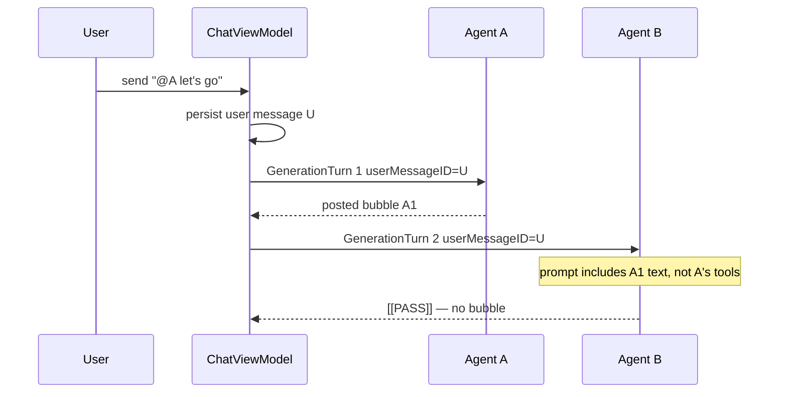

# Session Storage for Chat Generations and Heartbeats

| Field | Value |
| --- | --- |
| **Author** | TBD |
| **Date** | 2026-08-25 |
| **Status** | Draft |
| **Workspace** | `/Users/ez/code/Chat` |
| **Audience** | Engineers working on Chat persistence, `ModelClient`, and the Heartbeats window |

## Overview

Chat already persists a visible transcript (`StoredChat` / `StoredChatMessage` in `Chat/ChatStore.swift`) and an always-on heartbeat audit (`HeartbeatRun` in `Chat/AgentHeartbeats.swift`). It does **not** persist a generation session: which user message triggered a model call, which tools or skills ran, whether the agent posted or passed, or the prompt that produced the reply. `ModelClient.complete` returns a final `String`; the OpenAI tool loop in `OpenAICompatibleClient.respond` and the Apple `LanguageModelSession` tool transcript are discarded. Heartbeats make the opposite mistake: every `HeartbeatRun` stores the full `SYSTEM`/`USER` prompt and raw model output even when nobody asked for that volume of data (`MODEL_CONTEXT.md` issue 7).

This design adds a SwiftData **generation-turn** log that is queryable independently of the chat bubbles. Every model invocation — direct reply, per-agent group reply, or heartbeat — writes one `GenerationTurn` plus zero or more `ToolInvocation` rows. The visible transcript stays in `StoredChatMessage`. A per-agent **Debug log** toggle (off by default) gates a separate `GenerationDebugPayload` that stores the prompt, Apple transcript / OpenAI tool-loop messages, reasoning entries, and unsanitized model output. `HeartbeatRun` is kept as the compact Heartbeats-window row; bulky prompt/output moves behind debug.

Heartbeat persistence has a **single writer**: `AgentStore.recordHeartbeatCompletion`. `ChatViewModel.executeHeartbeat` never inserts a turn. Timeout and abort are distinguished by an explicit scheduler-slot outcome, not by `Task.isCancelled` alone. The scheduler owns the `ToolCallRecorder` for the in-flight run so a five-minute timeout can snapshot tools that already finished.

## Background & Motivation

### Current persistence

`ChatModelContainer.make()` in `Chat/ChatSchema.swift` builds an **unversioned** `ModelContainer` for:

- `Agent`, `AgentHeartbeat`, `HeartbeatRun`
- `LocalModel`, `ReplyFilterSet`, `TextToSpeechTool`
- `StoredChat`, `StoredGroupChatParticipant`, `StoredChatMessage`

If container creation fails, `removeStore(at:)` deletes the SQLite file, `-wal`, and `-shm`, then retries. There is no log of the original error. The container has no `VersionedSchema` and no `SchemaMigrationPlan`. New work must stay on the lightweight path: **new `@Model` types and optional fields only**. Do not reintroduce `VersionedSchema` on this unversioned store; a failed `ModelContainer` init today destroys user data, so schema work is gated on stopping that wipe (see Rollout / PR 0).

Foreign keys are UUIDs, not SwiftData `@Relationship`. That is consistent across `StoredChatMessage.chatID`, `AgentHeartbeat.agentID`, `HeartbeatRun.heartbeatID`, and `StoredGroupChatParticipant.chatID` / `agentID`. Session storage must follow the same pattern.

### Visible transcript is not a session log

`StoredChatMessage` stores `roleRawValue`, `text`, `authorAgentID`, `authorName`, `createdAt`. `ChatStore.fetchMessages(for:)` and `ChatViewModel.loadOlderMessages()` page 40 messages at a time. `ChatViewModel.allStoredMessages()` re-fetches the **entire** chat to build model context (`MODEL_CONTEXT.md`).

What the transcript cannot answer:

- Which tools ran for this assistant bubble (`ReadSkillFileTool`, `ExecuteSkillScript` in `Chat/SkillTools.swift`).
- Which skill folder was touched (`skill_name` argument).
- That an agent returned `[[PASS]]` or empty visible text and posted nothing (`ReplySanitizer.process` + `shouldPostAssistantReply` in `Chat/ChatViewModel.swift`).
- The prompt actually sent (system instructions + flattened transcript from `Chat/ModelPrompts.swift`).
- Group fan-out: one user message, N serial agent generations in `respondAsGroup(directlyMentionedAgentIDs:)`.

App-generated content is also in the same table: the direct-chat greeting in `ChatStore.makeDirectChat(with:)`, error bubbles (`"I could not get a response: …"`), and heartbeat posts. There is no generation id on those rows.

### Tool traces are discarded today

Apple path (`ModelClient.complete`):

```swift
let session = LanguageModelSession(
    tools: tools?.appleTools ?? [],
    instructions: systemPrompt
)
return try await session.respond(to: prompt).content
```

The session (and `session.transcript`) is dropped. Foundation Models `Transcript.Entry` includes `.instructions`, `.prompt`, `.reasoning`, `.toolCalls`, `.toolOutput`, and `.response`. This app does not stream a separate thinking channel; Apple reasoning exists only as transcript entries after `respond(to:)`.

OpenAI path (`OpenAICompatibleClient.respond`, max **8** rounds):

```swift
if !toolCalls.isEmpty, let tools {
    // append assistant tool_calls, execute, append role: "tool"
    continue
}
return content  // final string only
```

`AgentToolBox.execute(name:argumentsJSON:)` already has the tool name, JSON arguments, and result string. Nothing persists them.

### Heartbeat audit is the right shape, wrong payload

`HeartbeatRun` already snapshots agent name, instruction, destination, timestamps, `actionSummary`, and `errorMessage`. `AgentStore.recordHeartbeatCompletion` inserts a row for every attempt, including abort and the five-minute timeout in `HeartbeatScheduler.timeOut`. `HeartbeatsView`’s `CompletedHeartbeatRow` expands to **Model input** and **Model output** unconditionally.

`ChatViewModel.executeHeartbeat` builds that input as:

```text
SYSTEM
<heartbeat system instructions>

USER
<heartbeat conversation prompt>
```

That string is the full chat transcript plus memory plus skills list, stored on **every** run. Frequent schedules plus long chats are the storage-growth path called out in `MODEL_CONTEXT.md` issue 7. The product request is to keep a compact always-on heartbeat record and put bulky prompt/raw output behind debug.

`AgentStore.loadHeartbeatRuns()` fetches **every** `HeartbeatRun` with no `fetchLimit` into a `@Published` array that `HeartbeatsView` `ForEach`s. Historical rows already contain those full prompts, so RAM growth is a current bug, independent of the new schema.

### Per-agent debug flag does not exist

`Agent` (`Chat/AgentStore.swift`) has `enabledToolIDsJSON` / `enabledSkillIDsJSON` (opt-in, empty means none). Tools and skills are already per-agent toggles in `AgentEditor` via `OpenUISettingsRow` + `Toggle`. There is no debug-log flag. Debug must default **off** because prompts duplicate the entire history on every turn.

## Goals & Non-Goals

### Goals

1. Persist one **generation turn** per model invocation (direct, per-agent group reply, heartbeat), linked to the triggering user message when one exists.
2. Always persist **which tools/skills were called**, in call order, with arguments and a compact result. Heartbeat abort, error, and timeout flush the recorder snapshot from the scheduler slot. A tool still running at the timeout instant may be omitted (see Heartbeat single-writer protocol).
3. Persist enough to recover the **final visible reply** (or pass / empty / error) via `GenerationTurn.assistantMessageID` + `status` / `actionSummary`. Posted text lives in `StoredChatMessage`; the turn does not store a second copy of the bubble (`visibleReplyPreview` is a 280-character list snippet only).
4. When the responding agent’s Debug log is on, persist the **context sent to the model** and **intermediate/thinking artifacts** the backends actually expose.
5. Keep `HeartbeatRun` as the Heartbeats-window audit row. New runs **never** persist prompt or raw model output on that row (`modelInput = ""`, `modelOutput = nil`). Debug-on context lives only on `GenerationDebugPayload`. Compact write and Heartbeats empty-state copy ship in the same PR.
6. Add a per-agent Debug log toggle, off by default, OpenUI-styled in `AgentEditor`.
7. Capture tool calls from **both** Apple `LanguageModelSession` and the OpenAI tool loop without a custom SQLite/JSONL store.
8. Provide `FetchDescriptor` helpers for: all turns in a chat, tool calls for a turn, heartbeat runs for an agent, date ranges.
9. Stay on unversioned SwiftData: new models + optional properties; no `VersionedSchema`.

### Non-Goals

- Replacing `StoredChatMessage` as the source of model context. Prompts still come from `allStoredMessages()` as documented in `MODEL_CONTEXT.md`.
- SwiftData `@Relationship` graphs.
- Token budgeting, truncation of model context, or summarization (`MODEL_CONTEXT.md` issue 1 remains).
- Auto-pruning of turns, tool rows, or debug payloads in v1.
- A dedicated thinking stream for OpenAI-compatible local models (none exists in `OpenAICompatibleClient`).
- Feeding tool results back into later agents’ visible transcripts (today they never appear in `StoredChatMessage`).
- Chat deletion, turn deletion UI, or exporting sessions.
- OS background heartbeats, or fixing single-flight deferral (`MODEL_CONTEXT.md` issues 4–6) except where capture must handle abort/timeout.
- Waiting out a non-cooperative backend after the five-minute heartbeat timeout. The global heartbeat slot still releases at five minutes; late model output is still discarded before memory or posting.
- Parsing `<think>` / chain-of-thought tags some local models emit inside `content`. Those remain in raw debug output and may already be stripped from the bubble by `ReplyFilterSet`.

## Key Decisions

1. **Unified `GenerationTurn` for chat and heartbeats; keep `HeartbeatRun`.** One schema for “a model ran.” Heartbeats window and `AgentStore.heartbeatRuns` stay on `HeartbeatRun`. Dual-write of the compact heartbeat row plus a turn is cheaper and safer than migrating `HeartbeatRun` off an unversioned store. **Only `AgentStore.recordHeartbeatCompletion` inserts heartbeat turns.**

2. **`StoredChatMessage` remains the visible transcript.** Turns *point at* message UUIDs (`userMessageID`, `assistantMessageID`). Greeting, fake developer messages, and TTS playback are unchanged. Passes have a turn and no assistant message.

3. **No SwiftData `@Relationship`; UUID FKs only.** Matches `StoredChatMessage.chatID`, `HeartbeatRun.heartbeatID`, `StoredGroupChatParticipant.agentID`.

4. **No `VersionedSchema`.** Register new `@Model` types in `ChatModelContainer`. Add only optional columns to `Agent` and `HeartbeatRun`. Do not rename or remove `HeartbeatRun.modelInput` / `modelOutput`. Stop wiping the store on `ModelContainer` failure before the schema PR.

5. **Debug is a snapshot on the turn, not a live join to `Agent`.** `GenerationTurn.debugCaptureEnabled` records whether debug was on at `startedAt`. Toggling the agent later does not rewrite history or delete payloads.

6. **Tool invocations are always-on; prompts are debug-only.** Product requirement: store user message, tools/skills, final response. Optional: context and thinking. Compact-mode tool **results** are truncated; debug stores the full result.

7. **Capture tools at the `AgentToolBox` boundary, not by re-parsing the final string.** OpenAI already executes in `AgentToolBox.execute`. Apple executes in `ReadSkillFileTool.call` / `ExecuteSkillScriptTool.call`. Both write a `ToolCallRecorder`. Apple `.reasoning` entries are copied from `session.transcript` only when debug is on.

8. **Group chats: one turn per agent generation, all sharing the same `userMessageID`.** Serial order is `startedAt` among participants (the loop is serial and each call takes model latency). Later agents see earlier *posted* replies because those are already `StoredChatMessage` rows; they do not see sibling tool calls.

9. **Heartbeat bulky fields are starved, not deleted.** Compact write and Heartbeats empty-state copy ship in the **same** PR, so new `HeartbeatRun` rows always store `modelInput = ""` and `modelOutput = nil`. Debug data lives only on `GenerationDebugPayload`. Legacy rows keep their prompts and are shown as today. UI: non-empty `modelInput`/`modelOutput` (legacy) **or** payload (new debug-on) **or** muted “Debug log was off.”

10. **Do not load debug payloads (or unbounded run lists) into `AgentStore`.** Page `HeartbeatRun` **before** schema/capture work. Heartbeats UI faults debug on expand.

11. **`GenerationTurn.chatID` stays required.** Heartbeat turns are inserted only after the destination chat is known. Pre-destination failures remain `HeartbeatRun`-only (`generationTurnID == nil`).

## Proposed Design

### Conceptual model

A **turn** is one call into `ModelClient` (including its internal OpenAI tool loop or Apple tool round-trips) that produces one final assistant string, then `ReplySanitizer.process`.

| Orchestration | Trigger | Turns |
| --- | --- | --- |
| `ChatViewModel.send()` → `respond(userMessageID:)` | One persisted user `StoredChatMessage` | 1 (`kind = direct`) |
| `send()` → `respondAsGroup(userMessageID:directlyMentionedAgentIDs:)` | One persisted user message | 1 per `StoredGroupChatParticipant`, serial, same `userMessageID` |
| `ChatViewModel.executeHeartbeat` → `recordHeartbeatCompletion` | Schedule / Run Now / busy retry / timeout / abort | 1 (`kind = heartbeat`) when `chatID` is known; else `HeartbeatRun` only |
| Direct-chat greeting, `addFakeMessages`, `addSlowResponse` | App, not a model | 0 |



Heartbeat variant: no user message; `HeartbeatRun.generationTurnID` and `GenerationTurn.heartbeatRunID` are both set when a turn is written; optional post is a normal assistant `StoredChatMessage`.



### New SwiftData entities

New file `Chat/GenerationModels.swift` (SwiftData models + `GenerationKind` / `GenerationStatus`). New file `Chat/GenerationStore.swift` (insert + `FetchDescriptor` helpers). Register the three model types in `ChatModelContainer.make(configuration:)` and every in-memory preview container (`ContentView.swift`, `AgentEditor.swift`, `PreferencesView.swift`).

`CapturedToolInvocation` and `ToolCallRecorder` live in `Chat/SkillTools.swift` next to `AgentToolBox`, so capture can land before the schema PR. `GenerationStore.recordTurn` maps `CapturedToolInvocation` → `ToolInvocation`.

This target is `MACOSX_DEPLOYMENT_TARGET = 26.4` / `26.5.1`, so SwiftData `#Index` is available, but **the project has never used it**. PR 2 must compile `GenerationModels.swift` against an **on-disk** store before adding more indexes than the set below. Unique `id` remains `@Attribute(.unique)` like every other model.

#### `GenerationTurn`

```swift
enum GenerationKind: String {
    case direct
    case group
    case heartbeat
}

enum GenerationStatus: String {
    case posted
    case passed
    case emptyVisible
    case failed
    case aborted
    case timedOut
}

@Model
final class GenerationTurn: Identifiable {
    #Index<GenerationTurn>(
        [\.chatID, \.startedAt],
        [\.agentID, \.startedAt],
        [\.userMessageID],
        [\.assistantMessageID]
    )

    @Attribute(.unique) var id: UUID
    var kindRawValue: String
    var chatID: UUID
    var userMessageID: UUID?
    var assistantMessageID: UUID?
    var agentID: UUID
    var agentName: String
    var heartbeatID: UUID?
    var heartbeatRunID: UUID?
    var modelIdentifier: String
    var backendRawValue: String
    var startedAt: Date
    var completedAt: Date
    var statusRawValue: String
    var actionSummary: String
    var errorMessage: String?
    var visibleReplyPreview: String?
    var toolCallCount: Int
    var memoryEntryCount: Int
    var debugCaptureEnabled: Bool
    var createdAt: Date
}
```

Field notes:

- `kindRawValue` / `statusRawValue` are strings (same style as `StoredChat.kindRawValue`, `HeartbeatTargetKind`).
- `backendRawValue` comes from `ChatBackend.persistenceName` (`"appleFoundation"`, `"openAICompatible"`, `"missingLocalModel"`). `ChatBackend` is not `RawRepresentable` (`openAICompatible` carries `LocalModelConfiguration`). The helper must **not** persist endpoint or token:

```swift
extension ChatBackend {
    var persistenceName: String {
        switch self {
        case .appleFoundation: return "appleFoundation"
        case .openAICompatible: return "openAICompatible"
        case .missingLocalModel: return "missingLocalModel"
        }
    }
}
```

- `modelIdentifier`: chat snapshot (`storedChat.agentModelIdentifier`), group participant snapshot (`StoredGroupChatParticipant.agentModelIdentifier`), or heartbeat override (`heartbeat.modelIdentifier ?? agent.selectedModelIdentifier`). Same resolution as today’s generate paths.
- `agentName`: snapshot at generation time (`storedChat.agentName`, `participant.agentName`, or `agent.displayName` for heartbeats). Survives agent rename/delete the same way `HeartbeatRun.agentName` does.
- `visibleReplyPreview`: first 280 characters of posted visible text, or `nil` on pass/empty. List UIs should not fetch `StoredChatMessage` just to show a snippet. Full posted text is only on the message row.
- `toolCallCount` / `memoryEntryCount`: denormalized so chat bubbles can badge “2 tools” without fetching `ToolInvocation`.
- `debugCaptureEnabled`: stored as non-optional `Bool` on a **new** entity (safe). Default `false`.
- `chatID` is **required**. Heartbeat turns are not inserted until the destination chat UUID is known (see Heartbeat single-writer protocol).
- `heartbeatRunID` is set from the preallocated `HeartbeatRun.id` when the heartbeat writer inserts both rows. Inverse of `HeartbeatRun.generationTurnID`. Heartbeats UI loads tools via `run.generationTurnID`; `turnsInChat` does not need `heartbeatRunID` indexed.

`actionSummary` is required. Mapping:

| Status | Direct / group | Heartbeat (reuse today’s sentences) |
| --- | --- | --- |
| `.posted` | `"Posted."` | `"Posted to \(heartbeatDestinationDescription)."` plus memory clause |
| `.passed` | `"Passed."` | `"The model passed, so no chat message was posted."` plus memory clause |
| `.emptyVisible` | `"Empty visible reply."` | `"The model returned no visible text, so no chat message was posted."` plus memory clause |
| `.failed` | `error.localizedDescription` | Existing `failedHeartbeatReport` summaries (`"No chat message was posted."` / busy retry sentence) |
| `.aborted` | `"Aborted."` (unused on chat today) | `"Run was aborted. No chat message was posted."` |
| `.timedOut` | n/a | `"Timed out after 5 minutes. No chat message was posted."` |

Heartbeat memory clause stays as today: `"Appended N memory entry/entries."` joined with a space. Chat turns set `memoryEntryCount` and do not append that sentence unless we later want parity.

#### `ToolInvocation`

```swift
@Model
final class ToolInvocation: Identifiable {
    #Index<ToolInvocation>([\.turnID, \.sequence])

    @Attribute(.unique) var id: UUID
    var turnID: UUID
    var sequence: Int
    var roundIndex: Int
    var toolName: String
    var skillName: String?
    var argumentsJSON: String
    var resultText: String
    var resultTruncated: Bool
    var succeeded: Bool
    var errorMessage: String?
    var startedAt: Date
    var completedAt: Date
}
```

- `toolName` is `AgentToolID.rawValue`: `"ReadSkillFileTool"` or `"ExecuteSkillScript"`.
- `skillName` is parsed from arguments (`skill_name`) so queries can filter without JSON predicates. If JSON decode or skill lookup fails, `skillName` is `nil` and the raw arguments string is still stored.
- `roundIndex`: OpenAI chat-completion loop iteration, **0-based**, incremented once per `completeOnce` at the top of the loop (first HTTP round is 0). Do not use `8 - remainingRounds` after the existing `remainingRounds -= 1` (that yields 1 on the first round). Apple: always **0** in v1. Apple tool order is `sequence` only; do not walk `session.transcript` just to invent rounds.
- `sequence`: global order for the turn, starting at 0, assigned by `ToolCallRecorder`.
- Compact mode (debug off): `argumentsJSON` truncated to **4,096** characters; `resultText` to **8,192**. `resultTruncated = true` if either was cut. Debug on: store full strings, still cap each field at **1,000,000** characters with a trailing `\n…(truncated)` so a 256 KB skill-file read (`SkillFileAccess.maxFileBytes`) cannot unbounded-write a single column.
- Failed tool calls are rows with `succeeded = false` and `errorMessage` from `SkillAccessError` / `localizedDescription`. The OpenAI loop already turns execute failures into tool-role content and continues; persist both the error and that result string.

#### `GenerationDebugPayload`

```swift
@Model
final class GenerationDebugPayload: Identifiable {
    @Attribute(.unique) var id: UUID
    @Attribute(.unique) var turnID: UUID
    var systemPrompt: String
    var conversationPrompt: String
    var rawModelOutput: String
    var reasoningText: String?
    var intermediateAssistantJSON: String?
    var appleTranscriptSummary: String?
    var openAIMessagesJSON: String?
    var capturedAt: Date
}
```

`turnID` is already unique; do **not** add a redundant `#Index` on it.

Separate entity so `FetchDescriptor<GenerationTurn>` does not fault megabyte prompts. Never include this type in `AgentStore`’s published arrays.

| Field | Source |
| --- | --- |
| `systemPrompt` | `systemInstructions` passed to `ModelClient.complete` |
| `conversationPrompt` | Direct Apple: `appleFoundationPrompt`. Direct OpenAI: not a single string — serialize the `[ChatMessage]` list as JSON **and** copy `appleFoundationPrompt` for a human-readable fallback. Group/heartbeat: the `prompt` argument (flattened transcript). |
| `rawModelOutput` | String returned by the backend **before** `ReplySanitizer.process` / `AgentMemoryHarness.parse`. Heartbeats already call this `modelOutput`. |
| `reasoningText` | Apple `Transcript.Entry.reasoning` concatenated. `nil` on OpenAI and when the transcript has no reasoning entries. |
| `intermediateAssistantJSON` | OpenAI: `message.content` from rounds that also had `tool_calls`. Apple: any `.response` entries before the last one, if present. |
| `appleTranscriptSummary` | Debug-only pretty dump of transcript entry kinds + tool names (not a binary archive of `Transcript`; that type is not a stable persistence format). |
| `openAIMessagesJSON` | The in-memory `[OpenAIChatMessage]` array after the loop, including `tool` role rows. **Strip nothing except that we never persist bearer tokens** (they are not in messages). |

### Existing model changes (optional fields only)

#### `Agent` (`Chat/AgentStore.swift`)

```swift
var debugLogEnabled: Bool?  // nil == false
```

```swift
var isDebugLogEnabled: Bool { debugLogEnabled == true }
```

`AgentStore.updateAgentDebugLog(id:enabled:)` mirrors `setTool(_:enabled:for:)`. Do **not** add a non-optional `Bool` with a default; existing optional columns in this store are `kindRawValue: String?`, `memory: String?`, and similar.

Read the flag from the **live** `Agent` at generation start (`agentStore.agent(for:)`), same as soul/memory. Direct chats snapshot name/model on `StoredChat` but read current soul/memory; debug is live configuration like tools/skills, not a chat snapshot. Deleted agent → `false` (no debug payload).

#### `HeartbeatRun` (`Chat/AgentHeartbeats.swift`)

Add:

```swift
var generationTurnID: UUID?
```

Leave `modelInput: String` and `modelOutput: String?` in place.

| Era | `modelInput` | `modelOutput` | `generationTurnID` |
| --- | --- | --- | --- |
| Existing rows | Full SYSTEM/USER prompt | Raw output | `nil` |
| New, any debug flag | `""` | `nil` | set when a turn was inserted |

New debug-on data is **only** on `GenerationDebugPayload`, not duplicated onto `HeartbeatRun`. Compact write and Heartbeats expand copy ship together, so `CompletedHeartbeatRow` will not show “No model input was constructed” for new debug-off rows.

#### `StoredChatMessage`

No new columns in v1. Lookup is `GenerationTurn.assistantMessageID == message.id`. Avoids a lightweight migration on the hottest table (`ChatStore.messageBatchSize` / `allStoredMessages()`).

Predicates over optional UUIDs must capture a local `UUID?` (SwiftData pitfall):

```swift
let messageID: UUID? = message.id
var d = FetchDescriptor<GenerationTurn>(
    predicate: #Predicate { $0.assistantMessageID == messageID }
)
d.fetchLimit = 1
```

### How a turn is written (chat)

Shared helper on `GenerationStore` (MainActor, takes `ModelContext`). **Does not save.**

```swift
@discardableResult
func recordTurn(
    draft: GenerationTurnDraft,
    invocations: [CapturedToolInvocation],
    debug: GenerationDebugPayloadDraft?
) -> GenerationTurn
```

`ChatViewModel` remains the orchestrator; it already owns `appendMessage`, sanitization, and heartbeat posting. `GenerationStore` does not call the model.

```swift
@discardableResult
private func appendMessage(
    role: ChatRole,
    text: String,
    authorAgentID: UUID? = nil,
    authorName: String? = nil,
    save: Bool = true
) -> StoredChatMessage
```

When `save == false`, insert the row, update `storedChat.updatedAt`, append to `messages`, and skip `saveChanges()`. Callers that need one atomic save pass `save: false` and call `saveChanges()` after `recordTurn`.

#### Direct (`respond(userMessageID:)`)

Today `send()` persists the user row, then `respond()` calls `ModelClient.complete` and maybe appends an assistant row. Change:

1. `send()` keeps `appendMessage(role: .user, …)` (**save true**, so `allStoredMessages()` sees it) and holds `userMessage.id`.
2. `await respond(userMessageID: userMessage.id)`.
3. Create `ToolCallRecorder`. `generationSupport(for:recorder:)` passes it into `AgentToolBox.make`.
4. `let debug = agentStore.agent(for: storedChat.agentID)?.isDebugLogEnabled == true`.
5. `ModelClient.complete` → `ModelGenerationResult`.
6. `ReplySanitizer.process` as today; `appendAgentMemoryEntries` as today.
7. If `shouldPostAssistantReply`, `appendMessage(..., save: false)` and take its id.
8. On throw: still append the error bubble with `save: false` (current behavior, `MODEL_CONTEXT.md` issue 10) **and** record a `.failed` turn pointing at that bubble. Persist any invocations already on the recorder.
9. `recordTurn` then **one** `saveChanges()`.

Status mapping after sanitizer:

| Condition | Status | `actionSummary` |
| --- | --- | --- |
| Posted non-empty visible text | `.posted` | `"Posted."` |
| `isPass` | `.passed` | `"Passed."` |
| Empty visible, not pass | `.emptyVisible` | `"Empty visible reply."` |
| Thrown / backend error | `.failed` | `error.localizedDescription` |
| `Task.isCancelled` / `CancellationError` | `.aborted` | `"Aborted."` |

Direct chats do not currently honor cancel mid-reply (only heartbeats do). If that changes, use `.aborted` and do not post.

```swift
private func respond(userMessageID: UUID) async { … }

private func generationSupport(
    for agent: Agent?,
    recorder: ToolCallRecorder? = nil
) -> (tools: AgentToolBox, skillsPrompt: String) {
    let tools = AgentToolBox.make(agent: agent, catalog: skillCatalog, recorder: recorder)
    return (tools, ModelPrompts.skillsPrompt(for: tools.runtime.skills))
}
```

#### Group (`respondAsGroup(userMessageID:directlyMentionedAgentIDs:)`)

`send()` persists **one** user message (save true). Pass `userMessageID` into the loop. Each participant iteration:

- Resolves debug from `agentStore.agent(for: participant.agentID)` (per agent, not per chat).
- Uses `localModelStore.backend(for: participant.agentModelIdentifier)`.
- Creates its own recorder.
- Links the same `userMessageID`.
- `kind = .group`.
- Pass → turn with `assistantMessageID = nil` (no bubble). Failed → error bubble `save: false` + `.failed` turn.
- `recordTurn` + `saveChanges()` **once per participant** (later participants must see earlier posted replies in `allStoredMessages()`).

`groupResponse(from:wasDirectlyMentioned:recorder:)` returns `ModelGenerationResult`, not `String`.

### Heartbeat single-writer protocol

This replaces the draft that had `executeHeartbeat` insert a turn **and** `recordHeartbeatCompletion` insert another on timeout.



**Single writer.** `AgentStore.recordHeartbeatCompletion` is the only function that inserts `HeartbeatRun` and, when `report.chatID != nil`, `GenerationTurn` + `ToolInvocation` + optional `GenerationDebugPayload`. It calls `GenerationStore.recordTurn` then `saveChanges()` once. `ChatViewModel.executeHeartbeat` **must not** call `recordTurn`.

**Identity.** `HeartbeatScheduler.startExecution` allocates `runID = UUID()` and `turnID = UUID()` before creating the task. Both go on the execution slot and on every report. `recordHeartbeatCompletion` inserts:

```swift
HeartbeatRun(
    id: report.runID,
    …,
    generationTurnID: report.chatID == nil ? nil : report.turnID,
    modelInput: "",
    modelOutput: nil
)
// if report.chatID != nil:
GenerationTurn(
    id: report.turnID,
    chatID: report.chatID!,
    heartbeatRunID: report.runID,
    …
)
```

**Recorder ownership — one identity.** The scheduler allocates **one** `ToolCallRecorder` on the execution slot in `startExecution` and passes that instance into `ChatStore.executeHeartbeat` → `ChatViewModel.executeHeartbeat` → `AgentToolBox.make(agent:catalog:recorder:)`. `ChatViewModel.executeHeartbeat` **must not** allocate another `ToolCallRecorder()`. Direct and group paths (`respond` / `respondAsGroup`) still create their own recorders; heartbeat must use the slot’s. Timeout snapshots `slot.recorder`. If `executeHeartbeat` made a second instance, tools would land on the VM copy and the timeout snapshot would be empty.

PR 3 (capture, before heartbeat persist) must **leave `executeHeartbeat` recorder-less**: call `AgentToolBox.make` with `recorder: nil` (default) so chat call sites can compile with `.finalText` and a local recorder. PR 5’s checklist: one recorder identity from `startExecution` through `recordHeartbeatCompletion`; grep `executeHeartbeat` for `ToolCallRecorder()` must be empty.

Timeout can snapshot tools that already finished without waiting for the cancelled `Task`. `ExecuteSkillScript` may still be running on a `terminationHandler` thread; `ToolCallRecorder` uses `NSLock` (required).

**Timeout vs abort is a slot flag, not `Task.isCancelled`.** Both paths cancel the task. Extend the execution slot (today `(token: UUID, task: Task)`):

```swift
enum HeartbeatSlotOutcome {
    case running
    case timedOut
}

struct HeartbeatExecutionSlot {
    var token: UUID
    var task: Task<Void, Never>
    var runID: UUID
    var turnID: UUID
    var recorder: ToolCallRecorder
    var chatID: UUID?
    var debugCaptureEnabled: Bool
    var debugSystemPrompt: String?
    var debugConversationPrompt: String?
    var outcome: HeartbeatSlotOutcome
}
```

`RunningHeartbeat` (UI row) also carries `chatID: UUID?` and `debugCaptureEnabled: Bool` so the Heartbeats window and timeout path do not consult live `Agent` state.

**`onDestinationChat`.** `ChatStore.executeHeartbeat` resolves `targetChat` (including `makeDirectChat(with:)`) then immediately calls `onDestinationChat(targetChat.id)` **before** `targetChat.executeHeartbeat`. The scheduler copies that UUID onto the slot and `RunningHeartbeat`. This is the only way timeout, which is constructed in `startExecution` *before* destination resolution, can fill required `GenerationTurn.chatID`.

**Do not wait for the cancelled task on timeout.** Waiting would pin the global single-flight slot past five minutes when the backend ignores cancel (`MODEL_CONTEXT.md` issue 6). Protocol:

1. `timeOut` requires `slot.token == executionToken` and `slot.outcome == .running`.
2. Set `outcome = .timedOut`, cancel `slot.task`, snapshot `slot.recorder`.
3. Build a timeout `HeartbeatExecutionReport` with preallocated ids, `chatID` from the slot, `debugCaptureEnabled` from the slot, invocations from the snapshot, `generationStatus = .timedOut`.
4. Debug on: payload draft uses the **already-split** slot fields (`systemPrompt = slot.debugSystemPrompt ?? ""`, `conversationPrompt = slot.debugConversationPrompt ?? ""`). Do **not** concatenate them as today’s `SYSTEM\n…\nUSER\n…` `onModelInput` string, and do not parse that blob back apart. If the callback has not fired, both fields are `""`. Debug off: leave `debug` nil; do not store prompts on the slot.
5. Nil the slot (release single-flight), remove from `runningHeartbeats`, `recordHeartbeatCompletion`, `rescheduleHeartbeatAfterTimeout`.
6. When the cancelled task later returns, `executionTasks[id]?.token` does not match → **discard** the report. No second turn, no memory append, no chat post (same as today’s discard-after-timeout).

Tools that complete after the snapshot (in-flight `ExecuteSkillScript` at t=5:00) may be missing from the timeout record. That is the accepted gap. Tools that finished before t=5:00 are persisted. `executeHeartbeat` still must attach the recorder snapshot to `HeartbeatModelFailure` so **abort** (token still valid) and **model errors** flush tools.

**Abort.** `abort()` only cancels the task. `executeHeartbeat` throws `HeartbeatModelFailure(wasAborted: true)` with the recorder snapshot, `chatID`, ids, and prompt pieces if constructed. Scheduler sees matching token and `outcome == .running` → writes `.aborted` via `recordHeartbeatCompletion`. If timeout already claimed the slot, the abort report is discarded.

**`checkCancellation` vs `onModelResponseAccepted`.** Today `onModelResponseAccepted` runs *after* `Task.checkCancellation()` and *before* post/memory. Keep that: a timeout that wins during the model call still prevents posting. Capture is not tied to `onModelResponseAccepted`; it lives on the recorder and `HeartbeatModelFailure`.

**Debug prompt callback (replaces `runningModelInputs`).** Today `onModelInput` stores one concatenated `SYSTEM`/`USER` string. Delete that dictionary. When `slot.debugCaptureEnabled` is true, `ChatViewModel.executeHeartbeat` calls `onDebugPrompt(systemInstructions, conversationPrompt)` **after** those two strings are built and **before** `ModelClient.complete`, using the same values that a successful debug payload would store. The scheduler copies them onto `slot.debugSystemPrompt` / `slot.debugConversationPrompt`. Debug off: do not call the callback and do not keep prompts on the slot. New `HeartbeatRun` rows still get `modelInput = ""` / `modelOutput = nil` in every case.

#### `chatID` / turn insertion per `ChatStore.executeHeartbeat` branch

| Branch | `chatID` | Insert `GenerationTurn`? |
| --- | --- | --- |
| Cancelled at entry of `ChatStore.executeHeartbeat` (before destination) | `nil` | No. `HeartbeatRun` only |
| `HeartbeatExecutionError.agentMissing` | `nil` | No |
| `HeartbeatExecutionError.emptyInstruction` | `nil` | No |
| `HeartbeatExecutionError.targetMissing` | `nil` | No |
| `HeartbeatExecutionError.chatBusy` (thrown after `targetChat` is chosen) | `targetChat.id` | Yes, `.failed`, 0 tools |
| Success / pass / empty / model error / abort after destination | `targetChat.id` | Yes |
| Scheduler timeout after `onDestinationChat` | slot `chatID` | Yes, `.timedOut`, recorder snapshot |
| Scheduler timeout *before* `onDestinationChat` (should not happen; destination resolve is synchronous) | `nil` | No. `HeartbeatRun` only |

`debugCaptureEnabled` on the slot is read from `agentStore.agent(for: heartbeat.agentID)?.isDebugLogEnabled == true` at `startExecution` (deleted agent → false).

`HeartbeatModelExchange` / `HeartbeatModelFailure` / `HeartbeatExecutionReport` all carry the capture fields listed under API changes. `failedHeartbeatReport` copies `chatID`, ids, recorder snapshot, and debug flag from its arguments; it must not invent a second `turnID`.

### Capture: `ModelClient` API

Replace the `String` return with a result type. Keep a thin wrapper during the capture PR if needed (`complete` → `ModelGenerationResult`, call sites use `.finalText`).

```swift
struct ModelGenerationResult: Sendable {
    var finalText: String
    var reasoningTexts: [String]
    var intermediateAssistantTexts: [String]
    var openAIRoundCount: Int
    var debug: ModelDebugCapture?
}

struct ModelDebugCapture: Sendable {
    var appleTranscriptSummary: String?
    var openAIMessagesJSON: String?
}
```

`CapturedToolInvocation` is in `SkillTools.swift`:

```swift
struct CapturedToolInvocation: Sendable {
    var sequence: Int
    var roundIndex: Int
    var toolName: String
    var skillName: String?
    var argumentsJSON: String
    var resultText: String
    var succeeded: Bool
    var errorMessage: String?
    var startedAt: Date
    var completedAt: Date
}
```

`ModelClient.complete(..., captureDebug: Bool)` still takes `AgentToolBox?`. Recorder lives on the toolbox, not as a parallel argument, so Apple `Tool.call` and OpenAI `execute` share it.

#### OpenAI loop (`OpenAICompatibleClient`)

Today the loop mutates a local `messages` array and returns `content`. Changes:

```swift
var remainingRounds = 8
var roundIndex = 0
while remainingRounds > 0 {
    remainingRounds -= 1
    let currentRound = roundIndex
    roundIndex += 1
    // completeOnce; recorder reads currentRound via toolbox.roundProvider
}
```

First HTTP round is **0**. Do not compute `8 - remainingRounds` after decrement.

- Before each `completeOnce`, set the toolbox round provider to `currentRound`.
- `AgentToolBox.execute` records each call in `defer` (including throws).
- If `message.content` is non-empty alongside `toolCalls`, append to `intermediateAssistantTexts`.
- On final return, if `captureDebug`, JSON-encode `messages` (system + user/assistant/tool) into `openAIMessagesJSON`.
- `reasoningTexts = []`.
- Exhausted rounds (`"The model exceeded the maximum number of tool calls."`): throw as today, but leave invocations on the recorder; the caller records a `.failed` turn.

`OpenAIChatMessage` / `OpenAIToolCall` stay `private` in `ModelClient.swift`. Debug encoding stays inside that file.

#### Apple `LanguageModelSession`

Keep creating a **fresh session per turn** (`MODEL_CONTEXT.md`: no reuse). After `respond(to:)`:

```swift
let session = LanguageModelSession(tools: tools?.appleTools ?? [], instructions: systemPrompt)
let content: String
do {
    content = try await session.respond(to: prompt).content
} catch {
    if captureDebug { /* still read session.transcript */ }
    throw error
}
```

Tool rows come from `ToolCallRecorder` (timestamps + typed arguments). Do not rely on transcript parsing for arguments: `GeneratedContent` is a poor persistence format; `ReadSkillFileTool.Arguments` already has `skill_name` / `file_name`. Apple `roundIndex` is always 0.

When `captureDebug`:

- Walk `session.transcript` (Foundation Models `Transcript` is a `RandomAccessCollection` of `Transcript.Entry`).
- Concatenate `.reasoning` associated values into `reasoningTexts`.
- Build `appleTranscriptSummary` as a line-oriented log, for example:

```text
instructions
prompt
reasoning (chars=1204)
toolCalls ReadSkillFileTool
toolOutput ReadSkillFileTool (chars=8421)
response (chars=366)
```

If `respond` throws mid-loop, still snapshot the transcript and recorder.

This app does **not** call `streamResponse`. There is no token-level thinking UI. “Thinking / intermediate results” means: Apple `.reasoning` entries + OpenAI intermediate assistant content + the tool call/result list. Nothing else.

#### `ToolCallRecorder` and toolbox wiring

```swift
final class ToolCallRecorder: @unchecked Sendable {
    private let lock = NSLock()
    private var invocations: [CapturedToolInvocation] = []
    private var nextSequence = 0
    var roundProvider: @Sendable () -> Int = { 0 }

    func snapshot() -> [CapturedToolInvocation] { /* lock; return copy */ }

    func record(startedAt: Date, toolName: String, argumentsJSON: String, skillName: String?, result: Result<String, Error>) {
        // lock; append; sequence = nextSequence; nextSequence += 1; roundIndex = roundProvider()
    }
}

struct AgentToolBox {
    let runtime: SkillRuntime
    let enabledToolIDs: Set<String>
    let recorder: ToolCallRecorder?
}
```

`NSLock` is **required**, not optional: `ExecuteSkillScriptTool` resumes from `Process.terminationHandler` (background thread) and OpenAI `execute` runs on the cooperative thread of `URLSession`.

Record in **`defer`** inside both:

1. `AgentToolBox.execute(name:argumentsJSON:)` — OpenAI path. Use the **raw** `argumentsJSON` even when `JSONDecoder` fails. `skillName` from a best-effort decode of `skill_name`; `nil` on failure. On throw, `succeeded = false`, `errorMessage = error.localizedDescription`, `resultText` = that message (matches today’s tool-role content).
2. `ReadSkillFileTool.call` / `ExecuteSkillScriptTool.call` — Apple path. Encode `Arguments` to JSON for `argumentsJSON` (`skill_name` always present on the typed struct). On throw, same `succeeded = false` row.

Only one of Apple `call` vs OpenAI `execute` runs for a given generation. Do not also record from transcript `.toolCalls`. Comment that invariant on `AgentToolBox`.

`AgentToolBox.make(agent:catalog:)` adds `recorder:` (default `nil` for any future non-logged call sites). Chat generations create a fresh recorder. Heartbeats use the scheduler’s recorder.

### Per-agent Debug log UI

In `AgentEditor.editor(for:)`, add an OpenUI card after Skills (before Memory), section title **Diagnostics**:

```swift
OpenUISectionHeader(
    title: "Diagnostics",
    description: "Optional logs for inspecting prompts and tool traces."
)

OpenUISettingsRow(
    title: "Debug log",
    description: "Store the full model prompt and intermediate output for this agent’s chats and heartbeats. Off by default — this is a lot of data."
) {
    Toggle("Debug log", isOn: debugLogEnabled)
        .toggleStyle(.switch)
        .labelsHidden()
        .tint(OpenUITheme.accent)
}
```

Default off: `Toggle` binds to `agent.isDebugLogEnabled`. No global preferences toggle in v1 (debug is an agent concern, like tools). Do not add a Preferences section.

### Query surfaces

`GenerationStore` (or `enum GenerationQuery`) owns descriptors. All run on the existing main `ModelContext`.

```swift
enum GenerationQuery {
    static func turnsInChat(_ chatID: UUID, newestFirst: Bool = true) -> FetchDescriptor<GenerationTurn> {
        FetchDescriptor<GenerationTurn>(
            predicate: #Predicate { $0.chatID == chatID },
            sortBy: [SortDescriptor(\.startedAt, order: newestFirst ? .reverse : .forward)]
        )
    }

    static func turnsInChat(_ chatID: UUID, from: Date, to: Date) -> FetchDescriptor<GenerationTurn> {
        FetchDescriptor<GenerationTurn>(
            predicate: #Predicate { turn in
                turn.chatID == chatID && turn.startedAt >= from && turn.startedAt < to
            },
            sortBy: [SortDescriptor(\.startedAt, order: .reverse)]
        )
    }

    static func turnsForAgent(_ agentID: UUID, from: Date, to: Date) -> FetchDescriptor<GenerationTurn> { … }

    static func turn(forAssistantMessage messageID: UUID) -> FetchDescriptor<GenerationTurn> {
        let optionalID: UUID? = messageID
        var d = FetchDescriptor<GenerationTurn>(
            predicate: #Predicate { $0.assistantMessageID == optionalID }
        )
        d.fetchLimit = 1
        return d
    }

    static func turns(forUserMessage messageID: UUID) -> FetchDescriptor<GenerationTurn> {
        let optionalID: UUID? = messageID
        FetchDescriptor<GenerationTurn>(
            predicate: #Predicate { $0.userMessageID == optionalID },
            sortBy: [SortDescriptor(\.startedAt)]
        )
    }

    static func toolCalls(forTurn turnID: UUID) -> FetchDescriptor<ToolInvocation> {
        FetchDescriptor<ToolInvocation>(
            predicate: #Predicate { $0.turnID == turnID },
            sortBy: [SortDescriptor(\.sequence)]
        )
    }

    static func debugPayload(forTurn turnID: UUID) -> FetchDescriptor<GenerationDebugPayload> {
        var d = FetchDescriptor<GenerationDebugPayload>(
            predicate: #Predicate { $0.turnID == turnID }
        )
        d.fetchLimit = 1
        return d
    }

    static func heartbeatRunsForAgent(_ agentID: UUID) -> FetchDescriptor<HeartbeatRun> {
        FetchDescriptor<HeartbeatRun>(
            predicate: #Predicate { $0.agentID == agentID },
            sortBy: [SortDescriptor(\.completedAt, order: .reverse)]
        )
    }
}
```

`AgentStore.loadHeartbeatRuns()` today:

```swift
let descriptor = FetchDescriptor<HeartbeatRun>(
    sortBy: [SortDescriptor(\.completedAt, order: .reverse)]
)
heartbeatRuns = try modelContext.fetch(descriptor)
```

That loads every run, including historical `modelInput`. **This is a current RAM bug** and ships in PR 1, before schema:

- `fetchLimit = 200`, newest `completedAt` first (same idea as `ChatStore.messageBatchSize = 40`, larger because Heartbeats is a dedicated window).
- `loadOlderHeartbeatRuns()` mirrors `ChatViewModel.loadOlderMessages()`: predicate `completedAt < oldest.completedAt`, `fetchLimit = 200`, append.
- Heartbeats Completed section: load older on reaching the last row (or an explicit control). A cap **without** load-older is a history regression and is not acceptable.
- **`lastCompletedAt` backfill:** today, after the unbounded fetch, `loadHeartbeatRuns()` does `for heartbeat in heartbeats where heartbeat.lastCompletedAt == nil { heartbeat.lastCompletedAt = heartbeatRuns.first { $0.heartbeatID == heartbeat.id }?.completedAt }`. `recordHeartbeatCompletion` already sets `lastCompletedAt` on new runs, so this only repairs historical nils. After a 200-row **global** cap, using `heartbeatRuns` for that lookup would miss an older last run and leave `lastCompletedAt == nil` (heartbeat prompts use it as “time since last completed”). In PR 1: **do not** backfill from the paged array. For each heartbeat with `lastCompletedAt == nil`, fetch that heartbeat’s latest run with a dedicated descriptor (`heartbeatID ==`, sort `completedAt` reverse, `fetchLimit = 1`) and write that `completedAt`. If that fetch is empty, leave nil.

Heartbeats window generation-aware extensions (`Chat/HeartbeatsView.swift`) land with compact write (PR 5), not with paging:

- Completed row: keep agent / instruction / destination / time; muted caption from `actionSummary`.
- Expand: Action, Error (existing). New **Tools** list from `ToolInvocation` where `turnID == run.generationTurnID`.
- **Model input/output:** show if `!run.modelInput.isEmpty` or `run.modelOutput != nil` (legacy rows). Else if a `GenerationDebugPayload` exists for `generationTurnID`, show it. Else one muted line: “Debug log was off for this run.”
- Do not fetch payloads for collapsed rows.

Chat inspector v1 (`Chat/ContentView.swift` `MessageBubble`):

- Assistant bubbles with a matching turn and `toolCallCount > 0` (or debug payload) show a small wrench/ellipsis control next to the existing TTS speaker controls.
- Popover: tool name, skill, truncated arguments, truncated result, status. If `debugCaptureEnabled`, disclosure groups for system prompt, conversation prompt, reasoning, raw output (reuse `HeartbeatTextBlock` styling or OpenUI cards).
- User bubbles: no inspector in v1. Group passes remain invisible in the transcript (existing product behavior); they are in the turn table for later queries.

Later (not v1 UI): a Sessions window listing `GenerationTurn` like Heartbeats. The query API is the contract for that.

### What stays in `StoredChatMessage` vs the turn table

| Data | Where | Why |
| --- | --- | --- |
| User text | `StoredChatMessage` | Prompt construction (`conversationTranscript`, OpenAI `messages`) |
| Posted assistant text (full) | `StoredChatMessage` | UI, TTS (`TextToSpeechPlaybackService`), later prompts |
| Posted assistant preview (≤280 chars) | `GenerationTurn.visibleReplyPreview` | List/Heartbeats snippet without joining |
| Greeting / fake / slow messages | `StoredChatMessage` only | Not model generations |
| Error bubble text | `StoredChatMessage` + failed `GenerationTurn` | Today errors are agent speech in-group |
| Pass / empty | `GenerationTurn` only | Nothing to show in the transcript |
| Tool name / args / result | `ToolInvocation` | Never part of the visible transcript |
| Full prompt, reasoning, raw output | `GenerationDebugPayload` | Volume; debug-gated |
| Heartbeat instruction, destination label, action sentence | `HeartbeatRun` | Heartbeats window |
| Memory body | `Agent.memory` | Unchanged; turn stores `memoryEntryCount` only |

`ChatMessage` (the in-memory DTO) stays `Identifiable` with role/text/author/date. Do not add generation fields to every bubble in the `LazyVStack`. The inspector faults a turn by `assistantMessageID` on demand.

### Group chat specifics



- Mentioned participants run first (`respondAsGroup` sort). Turn `startedAt` preserves that order because generations are serial.
- `directlyMentioned` is an input to `ModelPrompts.groupConversationPrompt`; persist it on the turn as part of debug `conversationPrompt`, not as a separate column in v1.
- Two agents with different debug flags produce 0–2 payloads.

### Storage growth and retention

Rough local-only, single-user numbers:

| Record | Debug off | Debug on |
| --- | --- | --- |
| `GenerationTurn` | ~0.5–1 KB | same |
| `ToolInvocation` (0–N) | args ≤4 KB + result ≤8 KB each | up to 1 MB/field, typically skill file ≤256 KB |
| `GenerationDebugPayload` | absent | ≈ request size: system + full transcript. Tens of KB to >1 MB per turn as chats grow (`MODEL_CONTEXT.md` issue 1) |
| `HeartbeatRun` | ~0.5 KB (`modelInput` empty) | same compact row; prompt is on the payload |

**Current heartbeat path:** 144 runs/day × 50 KB prompt ≈ **7 MB/day** with no tools. **After:** ~100 KB/day compact; debug-on similar to today but on `GenerationDebugPayload` instead of `HeartbeatRun`.

`SkillFileAccess.maxFileBytes = 256_000` and script output truncation already bound tool results somewhat.

**v1 retention:**

- No automatic prune.
- Deleting an agent (`AgentStore.removeSelectedAgent`) already leaves `HeartbeatRun` rows; leave `GenerationTurn` rows too (audit). Heartbeats for that agent are deleted today; orphan `heartbeatID`s on turns are acceptable — keep the UUID even if the `AgentHeartbeat` row is gone, same as `HeartbeatRun.heartbeatID`.
- There is no chat-delete API (`modelContext.delete` is not used on `StoredChat`). If one is added later, delete turns/invocations/payloads for that `chatID` in the same save.
- Toggling Debug log **off** does not delete existing payloads.
- Follow-up (not blocking): Preferences action “Delete debug payloads” (`FetchDescriptor<GenerationDebugPayload>` + delete). Optional age cap (e.g. 14 days) behind a flag.

**v1 memory hygiene (blocking, ships first):** stop `AgentStore.loadHeartbeatRuns()` from fetching unbounded `modelInput`. Page 200 with load-older. Inspector and Heartbeats expand must fetch payload by `turnID` with `fetchLimit = 1`.

### Observability inside the app

No remote telemetry (local-only, no analytics backend). In-app:

- `assertionFailure` on save errors, same as `ChatStore.saveChanges` / `AgentStore.saveChanges`.
- Heartbeats window is the operational dashboard for scheduled generations.
- Chat inspector is the dashboard for interactive generations.
- `Logger` (`subsystem: "Chat", category: "Generation"`) at turn persist: chatID, kind, status, toolCallCount, debug yes/no, duration. No prompt text in logs.
- `Logger` (`subsystem: "Chat", category: "Persistence"`) on `ModelContainer` failure (PR 0). No prompt text.

Alerting: none. If save fails, the user already has no persistence signal except a debug assertion.

## API / Interface Changes

### `ModelClient`

```swift
// Before
static func complete(...) async throws -> String

// After
static func complete(
    using backend: ChatBackend,
    systemPrompt: String,
    prompt: String,
    tools: AgentToolBox? = nil,
    captureDebug: Bool = false,
    missingLocalModelMessage: String
) async throws -> ModelGenerationResult

static func complete(
    using backend: ChatBackend,
    systemPrompt: String,
    messages: [ChatMessage],
    appleFoundationPrompt: String,
    tools: AgentToolBox? = nil,
    captureDebug: Bool = false,
    missingLocalModelMessage: String
) async throws -> ModelGenerationResult
```

Call sites: `ChatViewModel.respond(userMessageID:)`, `groupResponse`, `executeHeartbeat` — the only callers today.

### `AgentToolBox`

```swift
@MainActor
static func make(
    agent: Agent?,
    catalog: SkillCatalog,
    recorder: ToolCallRecorder? = nil
) -> AgentToolBox
```

`ReadSkillFileTool` / `ExecuteSkillScriptTool` take `recorder`. `ChatBackend.persistenceName` as above.

### `AgentStore`

```swift
func updateAgentDebugLog(id: Agent.ID, enabled: Bool)
var Agent.isDebugLogEnabled: Bool { get }

func loadOlderHeartbeatRuns()  // PR 1; mirrors loadOlderMessages

func recordHeartbeatCompletion(
    heartbeatID: AgentHeartbeat.ID,
    agentID: Agent.ID,
    report: HeartbeatExecutionReport
)
```

`recordHeartbeatCompletion` inserts `HeartbeatRun(id: report.runID, generationTurnID: …)` with empty `modelInput`/`modelOutput`, and inserts the turn when `report.chatID != nil`. It is the only heartbeat turn writer.

### Heartbeat capture types

```swift
struct HeartbeatExecutionReport {
    // existing fields, plus:
    let runID: UUID
    let turnID: UUID
    let chatID: UUID?
    let debugCaptureEnabled: Bool
    let generationStatus: GenerationStatus
    let assistantMessageID: UUID?
    let memoryEntryCount: Int
    let modelIdentifier: String
    let backendRawValue: String
    let toolInvocations: [CapturedToolInvocation]
    let debug: GenerationDebugPayloadDraft?
    // New HeartbeatRun.modelInput / modelOutput are always "" / nil.
    // Timeout debug uses debug.systemPrompt + debug.conversationPrompt from the slot
    // (split fields, never a concatenated SYSTEM/USER blob).
}

struct HeartbeatModelExchange {
    let modelInput: String
    let modelOutput: String
    let actionSummary: String
    let runID: UUID
    let turnID: UUID
    let chatID: UUID
    let debugCaptureEnabled: Bool
    let generationStatus: GenerationStatus
    let assistantMessageID: UUID?
    let memoryEntryCount: Int
    let backendRawValue: String
    let toolInvocations: [CapturedToolInvocation]
    let debug: GenerationDebugPayloadDraft?
}

struct HeartbeatModelFailure: LocalizedError {
    // existing modelInput, modelOutput, message, wasAborted, plus:
    var runID: UUID
    var turnID: UUID
    var chatID: UUID?
    var debugCaptureEnabled: Bool
    var toolInvocations: [CapturedToolInvocation]
    var debug: GenerationDebugPayloadDraft?
}

struct RunningHeartbeat: Identifiable {
    // existing fields, plus:
    var chatID: UUID?
    var debugCaptureEnabled: Bool
}
```

`ChatStore.executeHeartbeat` gains `onDestinationChat: ((UUID) -> Void)?`, `onDebugPrompt: ((String, String) -> Void)?` (system, conversation; fired only when debug is on), and receives preallocated ids + the **scheduler’s** `ToolCallRecorder` (pass-through to the VM; the store does not allocate a recorder).

### `ChatViewModel` signatures

```swift
private func respond(userMessageID: UUID) async
private func respondAsGroup(userMessageID: UUID, directlyMentionedAgentIDs: Set<UUID>) async
private func groupResponse(
    from participant: StoredGroupChatParticipant,
    wasDirectlyMentioned: Bool,
    recorder: ToolCallRecorder
) async throws -> ModelGenerationResult
private func generationSupport(
    for agent: Agent?,
    recorder: ToolCallRecorder? = nil
) -> (tools: AgentToolBox, skillsPrompt: String)
@discardableResult
private func appendMessage(..., save: Bool = true) -> StoredChatMessage
```

`ChatViewModel.executeHeartbeat` takes `runID`, `turnID`, `recorder` (the scheduler’s instance, never a new one), `debugCaptureEnabled`, and `onDebugPrompt`. It does **not** take or invoke `onDestinationChat`. Destination identity is solely `ChatStore.executeHeartbeat`’s job: call `onDestinationChat(targetChat.id)` immediately after resolving `targetChat` (including `makeDirectChat`) and before `targetChat.executeHeartbeat`.

### New types

`GenerationTurn`, `ToolInvocation`, `GenerationDebugPayload`, `GenerationStore` / `GenerationQuery`, `ModelGenerationResult`, `ToolCallRecorder`, `CapturedToolInvocation`.

## Data Model Changes

### Container registration

`Chat/ChatSchema.swift`:

```swift
try ModelContainer(
    for: Agent.self,
    AgentHeartbeat.self,
    HeartbeatRun.self,
    LocalModel.self,
    ReplyFilterSet.self,
    TextToSpeechTool.self,
    StoredChat.self,
    StoredGroupChatParticipant.self,
    StoredChatMessage.self,
    GenerationTurn.self,
    ToolInvocation.self,
    GenerationDebugPayload.self,
    configurations: configuration
)
```

The project uses `PBXFileSystemSynchronizedRootGroup` for `Chat/`, so new files under `Chat/` join the target automatically.

### Migration strategy

0. **PR 0 (required before any schema change):** `ChatModelContainer.make()` must **not** call `removeStore` on `ModelContainer` failure. Log the error (`Logger` subsystem `Chat`, category `Persistence`) and rethrow so `ChatApp.init` still `fatalError`s, but the SQLite file, `-wal`, and `-shm` stay on disk. The wipe was a development convenience; it is unacceptable once we change the container shape. `removeStore` may remain as a private helper unused by `make()`, or be deleted.
1. Ship new entities + `Agent.debugLogEnabled: Bool?` + `HeartbeatRun.generationTurnID: UUID?`.
2. Rely on SwiftData lightweight migration. **Do not** introduce `SchemaMigrationPlan` or `VersionedSchema`.
3. **Required checklist for the schema PR:** copy a real on-disk store, launch the schema build against that copy, confirm agents/chats/heartbeats load. If init throws, the copy must still be intact (proves PR 0).
4. No backfill of `GenerationTurn` for historical chats. Historical `HeartbeatRun` rows remain valid with `generationTurnID == nil` and full `modelInput`.
5. Do not change `originalName: "personaID"` mappings.

### Consistency / save points

- **Chat user message:** `appendMessage` with default `save: true` before generation (required so `allStoredMessages()` includes it).
- **Chat assistant + turn + invocations + payload:** `appendMessage(..., save: false)`, `recordTurn` (no save), then one `saveChanges()` at the end of `respond(userMessageID:)` or each group-participant iteration.
- **Heartbeat:** one `saveChanges()` inside `recordHeartbeatCompletion` covering `HeartbeatRun` + optional turn graph.
- Do not claim same-save while leaving `appendMessage` saving on every insert.

Process death between user-message save and assistant/turn save is the same class of gap as today’s crashed in-flight reply (user bubble, no assistant). Process death during heartbeat completion is one save; either both run and turn exist or neither does, because they are inserted then saved together.

## Alternatives Considered

### 1. JSONL or sidecar files under `~/.chat/`

Skills already live in `~/.chat/skills`. Session logs as JSONL would avoid SwiftData migration risk and keep huge debug blobs off the main store.

**Rejected:** product requires SwiftData; querying date ranges and “tool calls for a turn” would mean a second index; the rest of the app (`HeartbeatRun`, messages) is SwiftData; sandbox/backup would split state.

### 2. Replace `HeartbeatRun` with `GenerationTurn` only

One table for all generations. Heartbeats window fetches `kind == heartbeat`.

**Rejected for v1:** requires migrating existing `HeartbeatRun` rows (instruction, destination, modelInput) onto a new type; high chance of needing `VersionedSchema` or leaving an orphan table; `AgentStore.heartbeatRuns: [HeartbeatRun]` and `CompletedHeartbeatRow` would all move at once. Revisit after the turn table is proven.

### 3. Encode tool traces as extra `StoredChatMessage` rows (hidden role)

A `role = tool` message would ride along with `allStoredMessages()`.

**Rejected:** those rows would enter Apple/OpenAI prompts unless filtered in every `ModelPrompts` path; batch loading and TTS would need to hide them; group later agents would see tool dumps as conversation. Audit data must not be conversational context.

### 4. Always store full prompts (status quo for heartbeats, extend to chat)

Simplest capture.

**Rejected:** `MODEL_CONTEXT.md` issue 7; product explicitly wants debug off by default because it is a lot of data. Interactive chats would duplicate the full history **per agent per user message**.

### 5. SwiftData `@Relationship` on turn → invocations

Cleaner faulting.

**Rejected:** every persisted association in this codebase is a UUID (`StoredChatMessage.chatID`, `HeartbeatRun.heartbeatID`, `StoredGroupChatParticipant.chatID` / `agentID`, including `originalName: "personaID"` remaps). Mixing `@Relationship` into an unversioned container is an unneeded migration surface. Indexed UUID predicates are enough.

### 6. Wait for the cancelled heartbeat task before writing the timeout row

Would persist in-flight tool results after `Process.terminate`.

**Rejected:** pins the single-flight heartbeat slot beyond five minutes when the backend ignores cancel. Snapshot the scheduler-owned recorder instead; omit tools still running at t=5:00.

## Security & Privacy Considerations

Local-only, single user, macOS (`Chat.entitlements`: audio input + network client). No account system.

| Threat | Severity | Mitigation |
| --- | --- | --- |
| Debug payloads contain the full chat, memory, soul, and skill file contents on disk in the default SwiftData store | Medium | Debug off by default; separate entity so casual fetches omit it; 1 MB field cap |
| Tool results may include secrets from user-authored scripts in `~/.chat/skills` | Medium | Same as running the script today; compact truncation reduces but does not remove secrets; do not add iCloud/sync |
| `openAIMessagesJSON` / prompts might include PII the user typed | Low (local) | Do not log prompt text via `Logger`; no network upload of turns |
| Bearer tokens | Low | Not part of `OpenAIChatMessage`; `LocalModelConfiguration.bearerToken` stays in Keychain/store as today — never copy into debug JSON |
| Inspector UI expands skill output in the main window | Low | Truncate in the popover; full text only when debug was on and the user expands |

No new network surface. No change to tool confinement (`SkillFileAccess.confinedFileURL`).

Turning debug on is a deliberate local recording setting, analogous to a verbose log file. The muted OpenUI description must say so.

## Observability

| Signal | How |
| --- | --- |
| Turn persisted | `Logger` category `Generation`: kind, status, toolCallCount, duration ms, debug bool |
| Save failure | Existing `assertionFailure("Failed to save chat:")` |
| Container init failure | `Logger` category `Persistence`; store **not** deleted |
| Heartbeat completed | Existing window + `actionSummary` |
| Debug volume | Count `GenerationDebugPayload` rows / approximate store file size in a later Preferences line if needed |
| Inspector miss | If `assistantMessageID` has no turn (greeting, fake messages, pre-feature history), hide the tool control — not an error |

No crash-only metrics pipeline.

## Rollout Plan

1. **PR 0 — wipe safety** must merge before any container-shape change.
2. **PR 1 — Heartbeat paging** can merge in parallel with PR 0; it has no schema dependency and fixes current RAM use of historical `modelInput`.
3. **Schema PR** (PR 2): launch against a **copied** real store; confirm chats, agents, heartbeats still load; confirm a failed init would no longer delete the copy.
4. **Capture PR** (PR 3) can ship with `.finalText` only; data starts accumulating once persist PRs land.
5. **Heartbeat compact write** (PR 5) ships with Heartbeats UI that understands empty `modelInput`. Do not land compact write without that copy.
6. Feature flag: **not required**. Debug log is the flag. Compact always-on data is small.
7. **Rollback:** revert the capture/persist call sites first (stop inserting turns). Leaving unused tables in the container is safe. Do **not** remove `@Model` types from `ModelContainer` after devices have stored rows (unversioned store). If we must abort after schema shipped, keep empty models registered.
8. No staged cohort; single-user local app.

## Risks

| Risk | Severity | Mitigation |
| --- | --- | --- |
| Lightweight migration failure used to wipe the store via `removeStore` | High | PR 0 removes wipe; log the error; required copied-store launch in PR 2; never use `VersionedSchema` |
| `AgentStore.loadHeartbeatRuns` loads all historical full prompts into RAM | High (current) | PR 1 paging + load-older, no schema dependency |
| Debug on + long chat + frequent heartbeats fills disk | Medium | Default off; 1 MB field caps; document no auto-prune; later “delete payloads” |
| Timeout omits a tool still running at t=5:00 | Low | Scheduler-owned recorder snapshot; documented; abort/error still flush |
| Apple `Transcript.Entry.reasoning` shape changes | Low | Debug-only; wrap extraction in a helper that fails soft (empty reasoning) |
| Recorder misses Apple tools if `Tool.call` is not wired | High for the feature | Record in `defer` on both `call` and `execute`; integration check: enable `ReadSkillFileTool`, confirm a `ToolInvocation` row |
| Error bubbles remain in the transcript and will get turns | Low | Matches current product; status `.failed` distinguishes them |

## Open Questions

1. **Compact tool result limit (8,192 chars)** vs always storing full tool results (bounded by 256 KB reads). Full always-on results would make “review what the skill returned” better without debug. Recommendation: start truncated; bump if inspectors feel useless.
2. **Group pass visibility:** any v1 indicator that an agent ran and passed, or query-only? Recommendation: query-only in v1.
3. **Follow-up Sessions window** vs extending Heartbeats to “all generations.” Not blocking.

Resolved since the previous draft: heartbeat timeout `chatID` (required column + `onDestinationChat`; no turn when unknown); debug-on `HeartbeatRun.modelInput` dual-write (dropped; compact write and Heartbeats UI ship together).

## References

- `Chat/ChatSchema.swift` — unversioned `ModelContainer`, wipe-on-failure (to be removed in PR 0)
- `Chat/ChatStore.swift` — `StoredChat`, `StoredChatMessage`, message batch size 40
- `Chat/ChatViewModel.swift` — `send`, `respond`, `respondAsGroup`, `executeHeartbeat`, `appendMessage`, `generationSupport`
- `Chat/ModelClient.swift` — Apple `LanguageModelSession`, OpenAI 8-round tool loop
- `Chat/SkillTools.swift` — `ReadSkillFileTool`, `ExecuteSkillScriptTool`, `AgentToolBox`
- `Chat/SkillCatalog.swift` — `AgentToolID`, `~/.chat/skills`
- `Chat/ReplyFilters.swift` — `ReplySanitizer.process`
- `Chat/AgentMemory.swift` — `AgentMemoryHarness.parse`
- `Chat/ModelPrompts.swift` — system/conversation/heartbeat prompts
- `Chat/AgentHeartbeats.swift` — `HeartbeatRun`, `HeartbeatScheduler` (15s tick, 5 min timeout, single-flight)
- `Chat/HeartbeatsView.swift` — Completed expand shows model input/output
- `Chat/AgentEditor.swift` — OpenUI toggles for tools/skills
- `Chat/GroupChats.swift` — `StoredGroupChatParticipant`, mention handles
- `MODEL_CONTEXT.md` — prompt contract; issues 1 (no context budget), 7 (heartbeat history growth)
- Foundation Models: [`Transcript`](https://developer.apple.com/documentation/foundationmodels/transcript), [`LanguageModelSession.transcript`](https://developer.apple.com/documentation/foundationmodels/languagemodelsession/transcript)

## PR Plan

Incremental, each PR reviewable and mergeable on main. Capture types live in `SkillTools.swift` / `ModelClient.swift` so the capture PR does not wait on schema. Always merge capture before persist. Paging and wipe safety do not wait on generation models.

### PR 0 — Stop wiping the SwiftData store on container failure

- **Title:** Do not delete the Chat store when ModelContainer init fails
- **Files:** `Chat/ChatSchema.swift`, `Chat/ContentView.swift` (`ChatApp` only if the `fatalError` message should include the logged error)
- **Depends on:** none
- **Changes:** Remove the `removeStore` retry from `ChatModelContainer.make()`. Log the `ModelContainer` error with `Logger(subsystem: "Chat", category: "Persistence")` and rethrow. User data remains on disk if lightweight migration fails. Required before any new `@Model` registration.

### PR 1 — Page HeartbeatRun history

- **Title:** Page completed heartbeat runs instead of loading the full audit log
- **Files:** `Chat/AgentStore.swift`, `Chat/HeartbeatsView.swift`
- **Depends on:** none (parallel with PR 0)
- **Changes:** `loadHeartbeatRuns()` uses `fetchLimit = 200`, newest `completedAt` first. Add `loadOlderHeartbeatRuns()` (predicate `completedAt < oldest`, limit 200). Heartbeats Completed section loads older on last-row appear (same pattern as `ChatViewModel.loadOlderMessages`). For heartbeats with `lastCompletedAt == nil`, backfill from a dedicated `FetchDescriptor` (`heartbeatID ==`, `completedAt` reverse, `fetchLimit = 1`) — **not** from the paged `heartbeatRuns` array. No schema, no compact write, no empty-input copy change. Fixes current RAM use of historical `modelInput` strings.

### PR 2 — Generation schema and Debug log toggle

- **Title:** Add SwiftData generation-turn models and per-agent Debug log toggle
- **Files:** `Chat/GenerationModels.swift` (new), `Chat/GenerationStore.swift` (new, insert/query helpers), `Chat/ChatSchema.swift`, `Chat/AgentStore.swift`, `Chat/AgentEditor.swift`, preview `ModelContainer` lists in `Chat/ContentView.swift`, `Chat/AgentEditor.swift`, `Chat/PreferencesView.swift`
- **Depends on:** PR 0
- **Changes:** Register `GenerationTurn`, `ToolInvocation`, `GenerationDebugPayload`. Indexes limited to `[chatID, startedAt]`, `[agentID, startedAt]`, `userMessageID`, `assistantMessageID` on turns and `[turnID, sequence]` on invocations. Add `Agent.debugLogEnabled: Bool?`, `isDebugLogEnabled`, `updateAgentDebugLog`. OpenUI Diagnostics card with Debug log switch, off by default. Add `HeartbeatRun.generationTurnID: UUID?`. Compile and launch against a **copied** on-disk store (checklist, not optional). No model-call behavior change. Query predicates use captured `UUID?` locals.

### PR 3 — Structured `ModelClient` results and tool recording

- **Title:** Return tool traces from Apple and OpenAI generation
- **Files:** `Chat/ModelClient.swift`, `Chat/SkillTools.swift`, `Chat/ChatViewModel.swift` (call sites use `.finalText` so behavior is unchanged), `Chat/LocalModels.swift` (`ChatBackend.persistenceName`)
- **Depends on:** none. **Merge before PR 4.** Do not parallel-merge with PR 4 (same `ChatViewModel` call sites).
- **Changes:** `ToolCallRecorder` + `CapturedToolInvocation` in `SkillTools.swift` (`NSLock` required). Recorder wired through `AgentToolBox.make`, `ReadSkillFileTool.call`, `ExecuteSkillScriptTool.call`, `AgentToolBox.execute` — record in `defer`, including throws, raw `argumentsJSON` on decode failure. Direct `respond` / `respondAsGroup` allocate a local recorder. **`executeHeartbeat` stays recorder-less** (`AgentToolBox.make` with `recorder: nil`); do not add `let recorder = ToolCallRecorder()` there — PR 5 threads the scheduler’s instance. `ModelGenerationResult` with `finalText`, `reasoningTexts`, `intermediateAssistantTexts`, optional debug capture from Apple `session.transcript` and OpenAI message array. OpenAI `roundIndex` starts at 0 and increments per loop iteration. Apple `roundIndex` is always 0. Preserve 8-round limit, tool-error-as-content, retry-without-tools on HTTP error. `ChatViewModel` still sanitizes `finalText` only. No SwiftData writes yet.

### PR 4 — Persist turns for direct and group chats

- **Title:** Persist generation turns and tool invocations for chat replies
- **Files:** `Chat/ChatViewModel.swift`, `Chat/GenerationStore.swift`
- **Depends on:** PR 2, PR 3
- **Changes:** `appendMessage(..., save:)` returns `StoredChatMessage`. `respond(userMessageID:)` and `respondAsGroup(userMessageID:directlyMentionedAgentIDs:)` write `GenerationTurn` + `ToolInvocation` (+ `GenerationDebugPayload` when the responding agent’s debug flag is on). One `saveChanges()` per direct reply / per group participant together with the assistant row. Failed generations write `.failed` and still point at the error bubble. Passes write a turn with nil assistant message. Greeting/fake/slow paths unchanged. Verify debug-off does not create payload rows.

### PR 5 — Compact heartbeat audit linked to generation turns

- **Title:** Stop storing heartbeat prompts by default; link HeartbeatRun to GenerationTurn
- **Files:** `Chat/ChatViewModel.swift`, `Chat/ChatStore.swift`, `Chat/AgentHeartbeats.swift`, `Chat/AgentStore.swift`, `Chat/HeartbeatsView.swift`
- **Depends on:** PR 2, PR 3 (does **not** depend on PR 4; `recordTurn` already exists). Does **not** include paging (PR 1).
- **Changes:** Implement the Heartbeat single-writer protocol: preallocated `runID`/`turnID`, scheduler-owned recorder passed into `executeHeartbeat` (checklist: no second `ToolCallRecorder()` in the VM), `onDestinationChat` on `ChatStore` only, slot `outcome` for timeout vs abort, `recordHeartbeatCompletion` inserts run + turn. New `HeartbeatRun.modelInput`/`modelOutput` always empty/nil. Replace `onModelInput` / `runningModelInputs` with `onDebugPrompt(system, conversation)` filling `slot.debugSystemPrompt` / `debugConversationPrompt` when debug is on; timeout payload uses those two fields, not a concatenated blob. Timeout snapshots the recorder (tools finished before t=5:00); late cancelled-task reports are discarded. Heartbeats Completed expand: Tools list; hide empty Model input/output; show payload when present; muted “Debug log was off” otherwise. `RunningHeartbeat` gains `chatID` and `debugCaptureEnabled`.

### PR 6 — Chat transcript inspector for tools and debug

- **Title:** Inspect tool calls and debug payloads from assistant messages
- **Files:** `Chat/ContentView.swift` (`MessageBubble`, new popover/sheet), possibly `Chat/HeartbeatsView.swift` (share `HeartbeatTextBlock` / extract a small debug viewer)
- **Depends on:** PR 4 (chat turns must exist). PR 5 optional but share UI pieces if it landed.
- **Changes:** On assistant bubbles, if a turn exists for `assistantMessageID` and (`toolCallCount > 0` or `debugCaptureEnabled`), show a control. Popover lists `ToolInvocation` in `sequence` order. Debug disclosure only when payload fetch succeeds. No inspector on user bubbles in v1. Pre-feature messages have no control.

### PR 7 — Debug retention follow-up

- **Title:** Optional debug payload cleanup and MODEL_CONTEXT heartbeat-history update
- **Files:** `Chat/GenerationStore.swift`, `Chat/PreferencesView.swift` or `Chat/AgentEditor.swift` (optional “Delete debug logs for this agent”), `MODEL_CONTEXT.md`
- **Depends on:** PR 2, PR 5
- **Changes:** Optional destructive action: delete `GenerationDebugPayload` rows for an agent (join through `GenerationTurn.agentID`). Still no auto-prune. Update `MODEL_CONTEXT.md` issue 7: compact heartbeat records; debug payloads are the remaining growth term. Heartbeat load-older is **not** in this PR (it shipped in PR 1).

PR 7 is independently shippable; if time is short, stop after PR 6 and leave retention as the documented non-goal.
